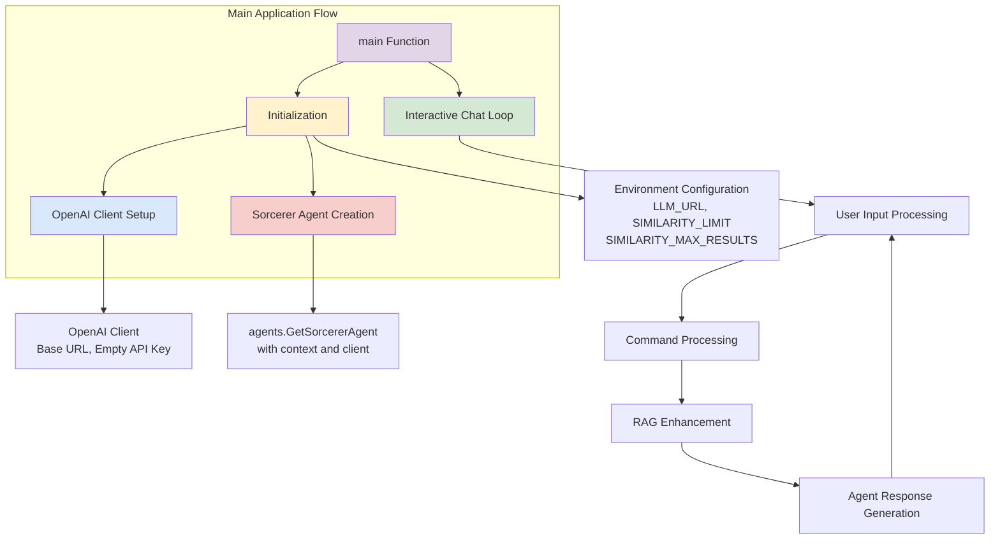
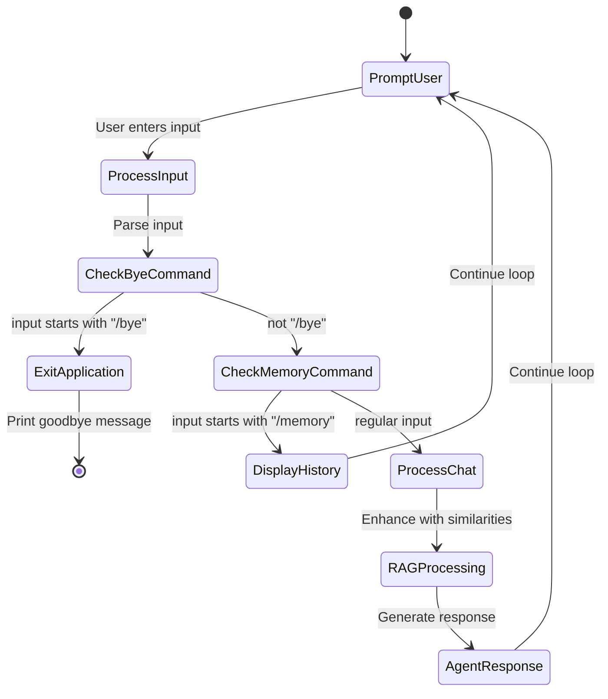
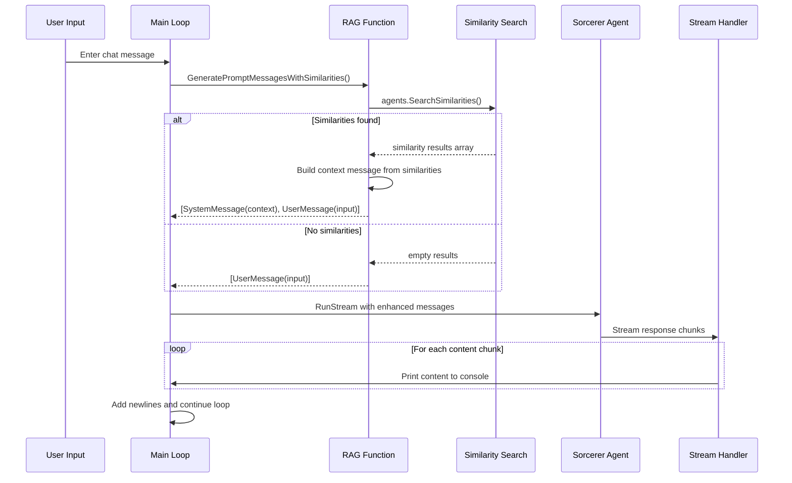
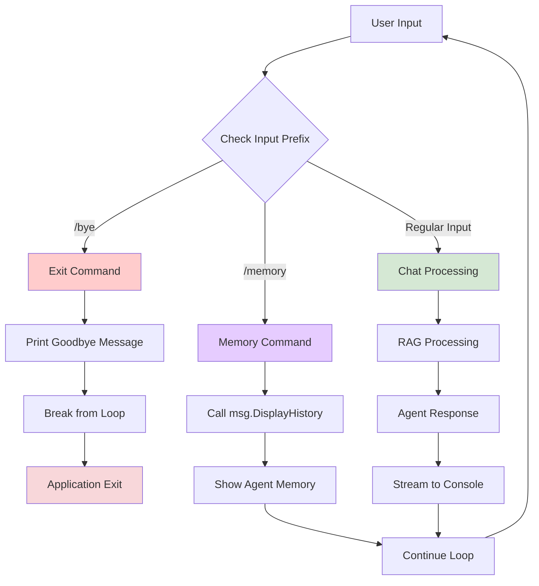
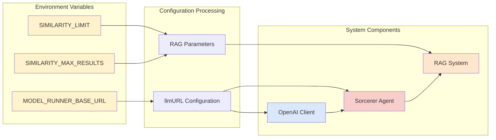
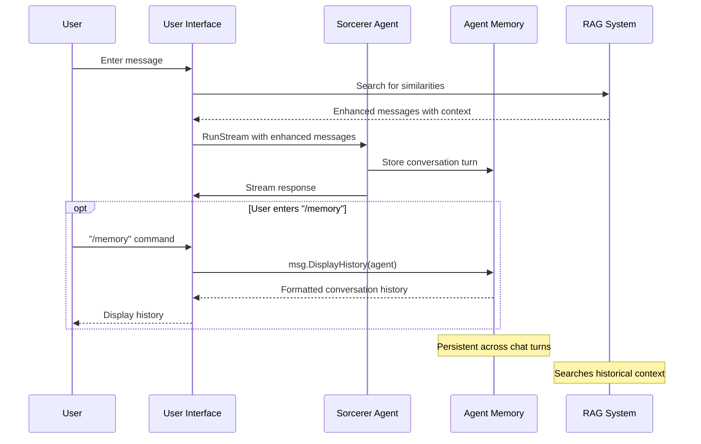

# Elara Sorcerer Agent Architecture

This document explains the architecture and flow of the Elara Sorcerer Agent application using various diagrams and explanations.

## System Architecture Overview

### System Architecture Explanation

This diagram shows the architecture of the Elara Sorcerer Agent, an interactive chat application with RAG capabilities. The system initializes with environment configuration, creates an OpenAI client and sorcerer agent, then enters an infinite chat loop. The loop processes user input, handles special commands, enhances prompts with RAG similarity search, and generates streaming responses. This creates a conversational AI experience where the agent can reference previous interactions and contextual information to provide more informed responses.

## Interactive Chat Loop Flow

### Interactive Chat Loop Explanation

This state diagram illustrates the main interactive loop of the Elara application. The system continuously prompts the user for input, then processes it through different paths based on the content. Special commands like "/bye" exit the application, "/memory" displays conversation history, while regular input goes through RAG processing and agent response generation. The loop structure ensures continuous interaction until the user explicitly exits, providing a persistent conversational experience with the sorcerer agent.

## RAG Similarity Search Process

### RAG Similarity Search Explanation

This sequence diagram shows how the RAG (Retrieval-Augmented Generation) system enhances user prompts with contextual information. When a user enters a message, the system searches for similar previous interactions or knowledge chunks. If similarities are found above the configured threshold, they are formatted into a context message that becomes part of the system prompt. This enhanced prompt is then sent to the sorcerer agent, which can reference the contextual information to provide more informed and relevant responses.

## Command Processing and Routing

### Command Processing Explanation

This flowchart demonstrates how the application routes different types of user input. The system uses prefix matching to identify special commands: "/bye" triggers application exit, "/memory" displays the agent's conversation history, while regular input goes through the full RAG and response generation pipeline. This command system provides users with control over the application state and debugging capabilities while maintaining the primary chat functionality.

## Environment Configuration and Setup

### Environment Configuration Explanation

This diagram shows how environment variables configure the various system components. The MODEL_RUNNER_BASE_URL sets the LLM endpoint for both the OpenAI client and sorcerer agent creation. SIMILARITY_LIMIT and SIMILARITY_MAX_RESULTS control the RAG system's behavior, determining the threshold for similarity matching and the maximum number of similar chunks to include in the context. This configuration approach allows the system to adapt to different deployment environments and fine-tune the RAG system's performance.

## Agent Memory and Context Management

### Agent Memory and Context Management Explanation

This sequence diagram illustrates how the sorcerer agent manages conversation memory and context. Each interaction through RunStream automatically adds the conversation turn to the agent's memory, creating a persistent history across chat sessions. The RAG system can search through this historical context to find relevant information for enhancing responses. Users can inspect this memory using the "/memory" command, providing transparency into what the agent remembers from previous conversations.