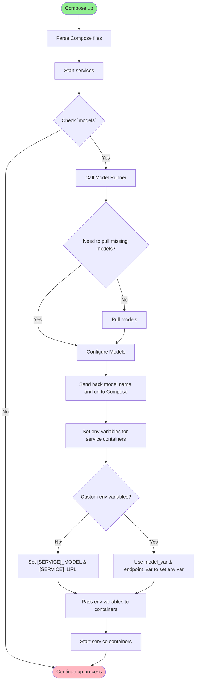

# How attaching models to services
The Compose way easy and straight forward

---
## `model` attribute of the service definition
- attach one or more models
- choose to configure or not the info passed to the container

```yaml
models:
  # simple definition
  non-player-character-model:
    model: ai/qwen2.5:1.5B-F16

services:
  sorcerer-agent:
  ...
  models:
    - non-player-character-model
```
---
## Customize Env variables
- By default, Compose send variables with names `[SERVICE]_MODEL` & `[SERVICE]_URL` to containers
- You can override those values to use the one you want with `model_var` & `endpoint_var`

```yaml
models:
  # simple definition
  non-player-character-model:
    model: ai/qwen2.5:1.5B-F16

services:
  sorcerer-agent:
  ...
  models:
    non-player-character-model:
      model_var: MY_CUSTOM_MODEL_VAR
      endpoint_var: MY_CUSTOM_URL_VAR
```

---
## How Compose handle interaction with Docker Model Runner

