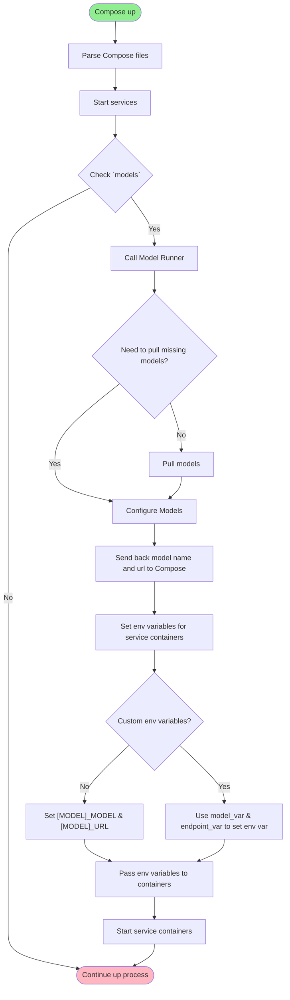

```mermaid
flowchart TD
    Start([Compose up]) --> ParseCompose[Parse Compose files]
    ParseCompose --> ComposeStartService[Start services]
    ComposeStartService --> CheckModels{"Check `models` "}
    CheckModels -->|No| ContinueComposeUP(["Continue up process"])
    CheckModels --> |Yes| CallMDR[Call Model Runner]
    CallMDR --> CheckPull{"Need to pull missing models?"}
    CheckPull --> |No| PullModels[Pull models]
    CheckPull --> |Yes| ConfigureModels[Configure Models]
    PullModels --> ConfigureModels
    ConfigureModels --> SendInfoCompose[Send back model name and url to Compose]
    SendInfoCompose --> PrepareEnvForService[Set env variables for service containers]
    PrepareEnvForService --> CheckCustomEnv{"Custom env variables?"}
    CheckCustomEnv --> |No| SetDefaultEnv["Set [MODEL]_MODEL & [MODEL]_URL"]
    CheckCustomEnv --> |Yes| SetCustomEnv["Use model_var & endpoint_var to set env var"]
    SetDefaultEnv --> PassEnvsToContainers[Pass env variables to containers]
    SetCustomEnv --> PassEnvsToContainers
    PassEnvsToContainers --> StartServices[Start service containers]
    StartServices --> ContinueComposeUP
    
    style Start fill:#90EE90
    style ContinueComposeUP fill:#FFB6C1
```