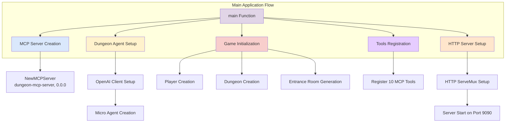
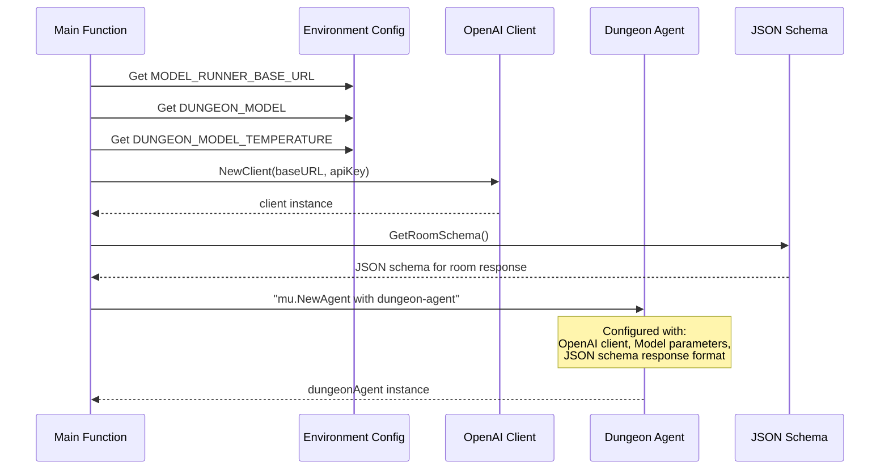
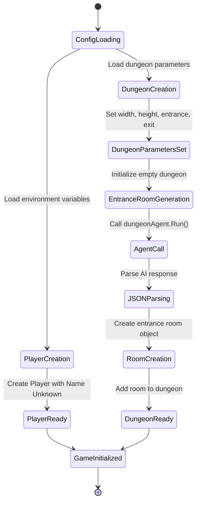
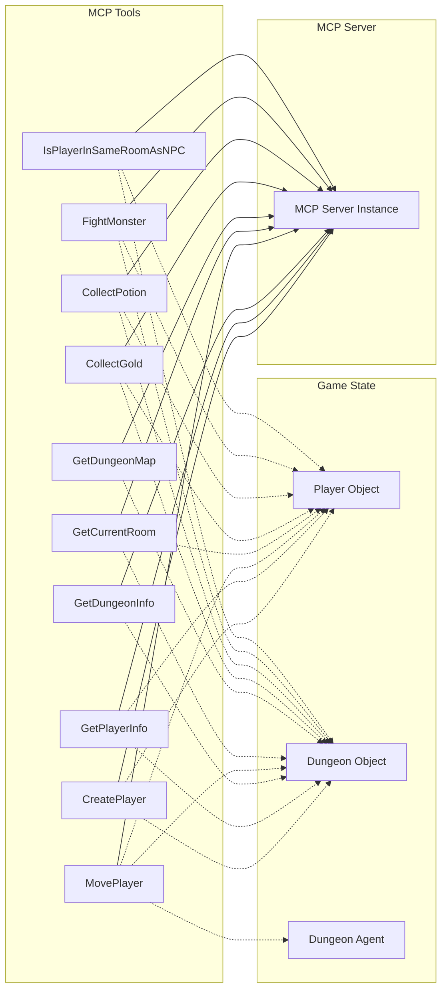
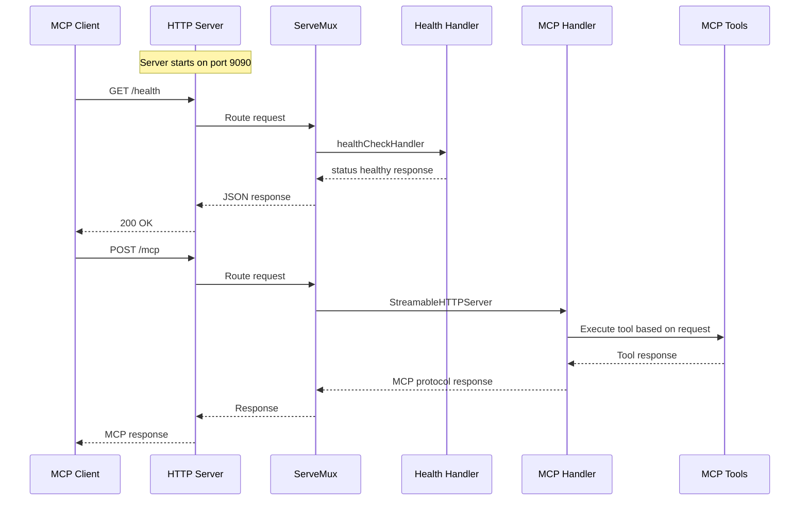
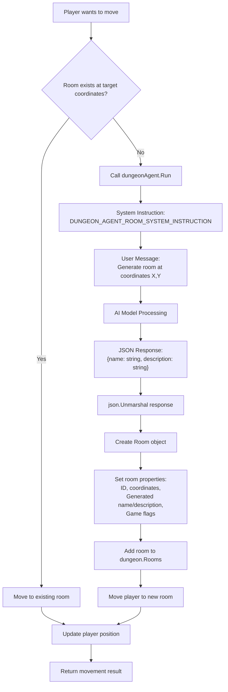

# Dungeon MCP Server Architecture

This document explains the architecture and flow of the Dungeon MCP Server application using various diagrams and explanations.

## System Architecture Overview

### System Architecture Explanation

This diagram shows the high-level initialization flow of the Dungeon MCP Server. The main function orchestrates six primary components: MCP Server creation, AI Agent setup, Game state initialization, MCP Tools registration, and HTTP Server configuration. Each component is responsible for a specific aspect of the dungeon crawler game infrastructure, working together to provide a complete Model Context Protocol (MCP) server that can generate and manage dungeon exploration experiences.

## Agent Setup and Configuration Flow

### Agent Setup Explanation

This sequence diagram illustrates how the AI agent is configured and initialized. The system first retrieves environment variables for the AI model configuration, creates an OpenAI-compatible client, and then initializes a "micro agent" with specific parameters. The agent is configured to respond in a structured JSON format using a predefined schema for room generation, ensuring consistent and parseable responses when generating dungeon content.

## Game State Initialization Process

### Game State Initialization Explanation

This state diagram shows how the game initializes its core state components. The process begins by loading configuration from environment variables, then creates both a player object and dungeon structure in parallel. The dungeon initialization includes a special step where the AI agent generates the entrance room dynamically, calling the language model to create appropriate name and description content. This ensures that each game session can have unique, contextually appropriate entrance rooms while maintaining the required game structure.

## MCP Tools Registration Architecture

### MCP Tools Registration Explanation

This diagram illustrates how MCP (Model Context Protocol) tools are registered with the server and how they interact with the game state. Each tool is registered with the MCP server and has access to shared references to the player object, dungeon object, and in some cases the AI agent. The dotted lines show the data dependencies - for example, the MovePlayer tool needs access to all three components because it updates player position, modifies dungeon state, and may call the AI agent to generate new rooms as the player explores.

## HTTP Server Request Flow

### HTTP Server Request Flow Explanation

This sequence diagram shows how HTTP requests are handled by the server. The server uses a custom ServeMux to route requests to two different endpoints: `/health` for health checks (useful for Docker Compose deployments) and `/mcp` for actual MCP protocol communication. When MCP requests are received, they are processed by the StreamableHTTPServer which then delegates to the appropriate registered tools based on the request content. This architecture allows the same server to handle both infrastructure monitoring and the core dungeon crawler game logic.

## Data Flow During Room Generation

### Room Generation Data Flow Explanation

This flowchart demonstrates the dynamic room generation process that occurs during gameplay. When a player attempts to move to an unexplored area, the system first checks if a room already exists at those coordinates. If not, it triggers the AI agent to generate appropriate room content. The AI receives system instructions and a user prompt, then returns structured JSON containing the room's name and description. This response is parsed and used to create a full room object with all necessary game properties before being added to the dungeon and allowing the player to enter.