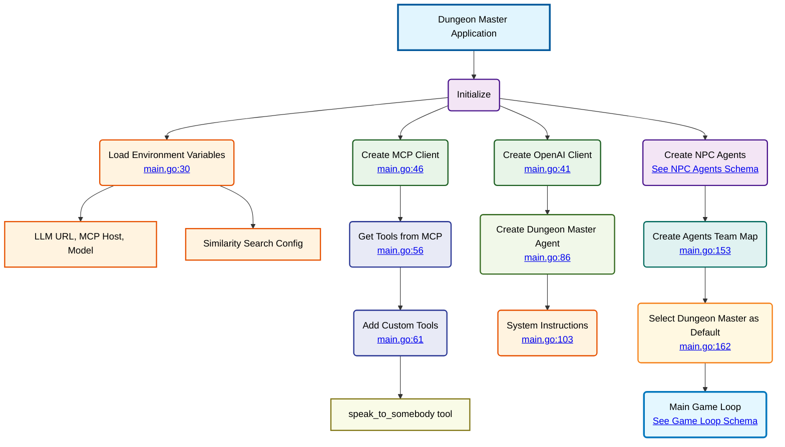

# Dungeon Master Application

## Main Function Flow (<a href="/dungeon-master/main.go#L26">main()</a>)

The main function orchestrates the entire Dungeon Master application:

1. **Environment Setup** (<a href="/dungeon-master/main.go#L30-L39">lines 30-39</a>)
   - Load LLM URL, MCP Host, and Model configuration
   - Configure similarity search parameters

2. **Client Initialization** (<a href="/dungeon-master/main.go#L41-L51">lines 41-51</a>)
   - Create OpenAI client for LLM interactions
   - Initialize MCP client for tool communication

3. **Tools Configuration** (<a href="/dungeon-master/main.go#L56-L78">lines 56-78</a>)
   - Retrieve tools catalog from MCP server
   - Add custom `speak_to_somebody` tool

4. **Agent Creation** (<a href="/dungeon-master/main.go#L86-L162">lines 86-162</a>)
   - **Dungeon Master Agent**: Main agent with tools capability
   - **NPC Agents**: See [NPC Agents Schema](003-schema-npc-agents-system.md) for detailed information
   - Create agents team map for easy access

5. **Game Loop** - See [Game Loop Schema](004-schema-main-loop.md) for detailed information
   - Handle user input and commands
   - Route conversations to appropriate agents
   - Process tool calls and game logic

## Key Components

### Agent Types
- **Dungeon Master** (<a href="/dungeon-master/main.go#L231-L264">lines 231-264</a>): Main agent with full tool access
- **NPC Agents**: See [NPC Agents Schema](003-schema-npc-agents-system.md) for detailed information about Ghost, Guard, Sorcerer, Merchant, Healer, and Boss agents

### Tool Execution Handler

See [Game Loop Schema](004-schema-main-loop.md) for detailed tool execution flow. Main categories:
1. **Custom Tools**: `speak_to_somebody` with room validation
2. **MCP Tools**: Delegated to MCP server

### RAG Integration (<a href="/dungeon-master/main.go#L611-L637">GeneratePromptMessagesWithSimilarities</a>)

Enhances NPC interactions with contextual information through similarity search. See [NPC Agents Schema](003-schema-npc-agents-system.md) for detailed RAG implementation.

### Game Commands

See [Game Loop Schema](004-schema-main-loop.md) for detailed command implementation:
- `/bye`: Exit the game
- `/back-to-dm` or `/dm`: Return to Dungeon Master
- `/memory`: Display conversation history
- `/agents`: List all available agents
- `/tools`: Display available tools

## Agent Team Structure

The agents team structure is detailed in [NPC Agents Schema](003-schema-npc-agents-system.md). The main structure includes:
- **Dungeon Master**: Main agent with tools
- **NPC Agents**: Ghost, Guard, Sorcerer, Merchant, Healer, Boss