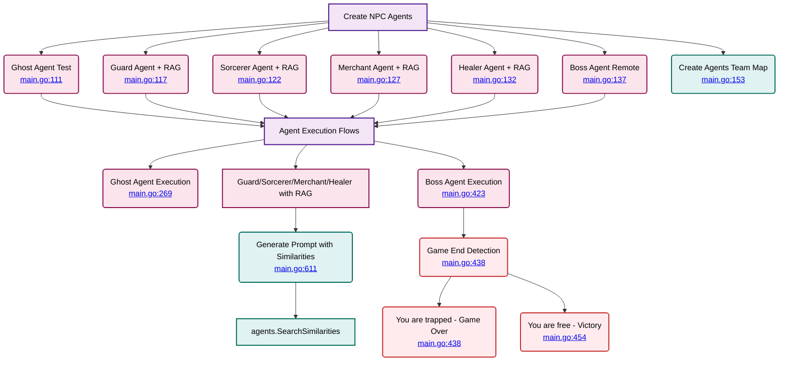

# NPC Agents System

⬅️ **Back to:** [Dungeon Master Schema](./002-schema-dungeon-master.md)



## NPC Agent Types

### Ghost Agent (<a href="/dungeon-master/main.go#L111-L112">lines 111-112</a>)
- **Purpose**: Test agent for development
- **Implementation**: Simple fake agent
- **Usage**: Always available for testing
- **Execution**: Direct streaming without tools (<a href="/dungeon-master/main.go#L269-L286">lines 269-286</a>)

### Guard Agent (<a href="/dungeon-master/main.go#L117">line 117</a>)
- **Type**: RAG-enabled NPC
- **Implementation**: `agents.GetGuardAgent(ctx, client)`
- **Features**: Similarity search integration
- **Execution**: With RAG context (<a href="/dungeon-master/main.go#L291-L320">lines 291-320</a>)

### Sorcerer Agent (<a href="/dungeon-master/main.go#L122">line 122</a>)
- **Type**: RAG-enabled NPC
- **Implementation**: `agents.GetSorcererAgent(ctx, client)`
- **Features**: Similarity search integration
- **Execution**: With RAG context (<a href="/dungeon-master/main.go#L324-L353">lines 324-353</a>)

### Merchant Agent (<a href="/dungeon-master/main.go#L127">line 127</a>)
- **Type**: RAG-enabled NPC
- **Implementation**: `agents.GetMerchantAgent(ctx, client)`
- **Features**: Similarity search integration
- **Execution**: With RAG context (<a href="/dungeon-master/main.go#L357-L386">lines 357-386</a>)

### Healer Agent (<a href="/dungeon-master/main.go#L132">line 132</a>)
- **Type**: RAG-enabled NPC
- **Implementation**: `agents.GetHealerAgent(ctx, client)`
- **Features**: Similarity search integration
- **Execution**: With RAG context (<a href="/dungeon-master/main.go#L390-L419">lines 390-419</a>)

### Boss Agent (<a href="/dungeon-master/main.go#L137-L141">lines 137-141</a>)
- **Type**: Remote agent
- **Implementation**: `agents.NewBossAgent(name, url)`
- **Features**: Game-ending logic
- **Remote URL**: Configurable via `BOSS_REMOTE_AGENT_URL`
- **Execution**: With victory/defeat detection (<a href="/dungeon-master/main.go#L423-L475">lines 423-475</a>)

## Agent Team Structure (<a href="/dungeon-master/main.go#L153-L161">lines 153-161</a>)

```go
agentsTeam = map[string]mu.Agent{
    idDungeonMasterToolsAgent: dungeonMasterToolsAgent,  // Main DM
    idGhostAgent:              ghostAgent,               // Test agent
    idGuardAgent:              guardAgent,               // RAG-enabled
    idSorcererAgent:           sorcererAgent,            // RAG-enabled
    idMerchantAgent:           merchantAgent,            // RAG-enabled
    idHealerAgent:             healerAgent,              // RAG-enabled
    idBossAgent:               bossAgent,                // Remote agent
}
```

## RAG Integration (<a href="/dungeon-master/main.go#L611-L637">GeneratePromptMessagesWithSimilarities</a>)

The RAG (Retrieval-Augmented Generation) system enhances NPC interactions:

1. **Similarity Search** (<a href="/dungeon-master/main.go#L614">line 614</a>)
   - Uses `agents.SearchSimilarities()` to find relevant context
   - Configured with similarity limit and max results

2. **Context Enhancement** (<a href="/dungeon-master/main.go#L623-L630">lines 623-630</a>)
   - Adds contextual information to system messages
   - Improves NPC response relevance

3. **Fallback Handling** (<a href="/dungeon-master/main.go#L632-L636">lines 632-636</a>
   - Graceful degradation when no similarities found
   - Maintains conversation flow

## Game End Logic (Boss Agent)

### Victory Condition (<a href="/dungeon-master/main.go#L454-L468">lines 454-468</a>)
- **Trigger**: Response contains "you are free"
- **Action**: Display victory message and player info
- **MCP Call**: Direct call to `get_player_info`

### Defeat Condition (<a href="/dungeon-master/main.go#L438-L452">lines 438-452</a>)
- **Trigger**: Response contains "you are trapped"
- **Action**: Display game over message and player info
- **MCP Call**: Direct call to `get_player_info`

---

⬅️ **Back to:** [Dungeon Master Schema](002-schema-dungeon-master.md)