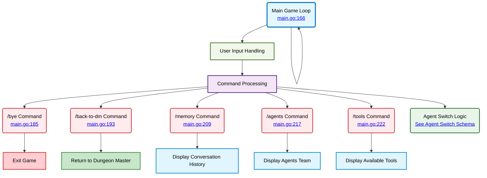

# Main Game Loop System

⬅️ **Back to:** [Dungeon Master Schema](./002-schema-dungeon-master.md)



## Game Loop Overview (<a href="/dungeon-master/main.go#L166-L481">lines 166-481</a>)

The main game loop handles all user interactions and manages the conversation flow between the player and various agents in the dungeon.

### User Input Processing (<a href="/dungeon-master/main.go#L166-L180">lines 166-180</a>)

The loop displays different prompts based on the currently selected agent:
- **Dungeon Master prompt**: `🤖 (/bye to exit) [agent_name]>`
- **NPC prompt**: `🙂 (/bye to exit /dm to go back to the DM) [agent_name]>`

### System Commands

#### Exit Command (<a href="/dungeon-master/main.go#L185-L188">lines 185-188</a>)
- **Trigger**: `/bye`
- **Action**: Terminates the game loop
- **Message**: "👋 Goodbye! Thanks for playing!"

#### Navigation Commands (<a href="/dungeon-master/main.go#L193-L206">lines 193-206</a>)
- **Triggers**: `/back-to-dm`, `/dm`, `/dungeonmaster`
- **Action**: Returns to Dungeon Master agent
- **Condition**: Only works when not already talking to DM
- **Uses**: `continue` to skip to next loop iteration

#### Debug Commands
- **Memory Command** (<a href="/dungeon-master/main.go#L209-L212">lines 209-212</a>)
  - **Trigger**: `/memory`
  - **Action**: Display conversation history via `msg.DisplayHistory()`

- **Agents Command** (<a href="/dungeon-master/main.go#L217-L220">lines 217-220</a>)
  - **Trigger**: `/agents`
  - **Action**: Display team information via `DisplayAgentsTeam()`

- **Tools Command** (<a href="/dungeon-master/main.go#L222-L225">lines 222-225</a>)
  - **Trigger**: `/tools`
  - **Action**: Display available tools via `DisplayToolsIndex()`

## Agent Execution Logic

The agent execution logic is detailed in [Agent Switch Logic Schema](005-schema-agent-switch-logic.md). This includes:

- **Switch Statement Routing**: Based on selected agent name
- **Dungeon Master Execution**: With tool detection and execution
- **Tool Execution Handler**: User confirmation and function routing
- **speak_to_somebody Implementation**: Room validation and agent selection
- **MCP Tool Execution**: Default tool execution flow

## Display Functions

### MCP Tool Call Result (<a href="/dungeon-master/main.go#L639-L643">lines 639-643</a>)
```go
fmt.Println(strings.Repeat("-", 3) + "[MCP RESPONSE]" + strings.Repeat("-", 33))
fmt.Println(results[0])
fmt.Println(strings.Repeat("-", 50))
```

### Tools Index (<a href="/dungeon-master/main.go#L645-L650">lines 645-650</a>)
```go
for _, tool := range toolsIndex {
    ui.Printf(ui.Magenta, "Tool: %s - %s\n", tool.GetFunction().Name, tool.GetFunction().Description)
}
```

### Agents Team (<a href="/dungeon-master/main.go#L652-L657">lines 652-657</a>)
```go
for agentId, agent := range agentsTeam {
    ui.Printf(ui.Cyan, "Agent ID: %s agent name: %s model: %s\n", agentId, agent.GetName(), agent.GetModel())
}
```

### DM Response (<a href="/dungeon-master/main.go#L659-L664">lines 659-664</a>)
```go
ui.Println(ui.Green, strings.Repeat("-", 3)+"[DM RESPONSE]"+strings.Repeat("-", 34))
fmt.Println(assistantMessage)
ui.Println(ui.Green, strings.Repeat("-", 50))
```

## Flow Control

The game loop uses several flow control mechanisms:

1. **continue**: Skip to next iteration (navigation commands, debug commands)
2. **break**: Exit main loop (bye command, game end conditions)
3. **switch/case**: Route execution to appropriate agent
4. **Error handling**: Panic on critical errors, graceful degradation otherwise

---

⬅️ **Back to:** [Dungeon Master Schema](002-schema-dungeon-master.md)