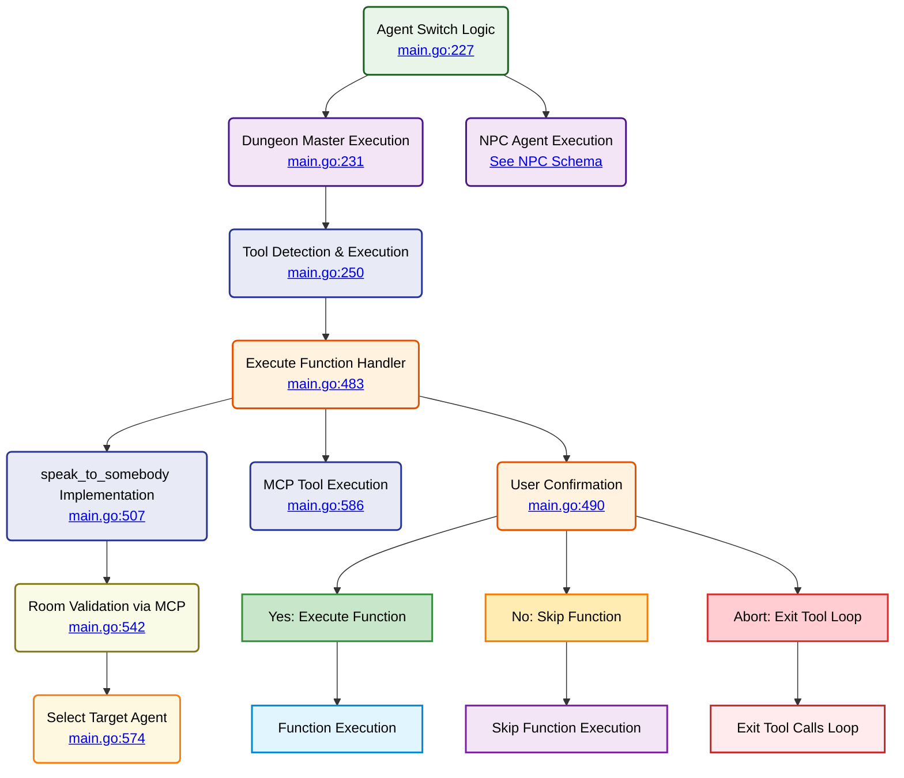

# Agent Switch Logic System

⬅️ **Back to:** [Game Loop Schema](./004-schema-main-loop.md)



## Agent Switch Logic Overview (<a href="/dungeon-master/main.go#L227-L479">lines 227-479</a>)

The agent switch system routes execution to different agents based on the currently selected agent using a switch statement on `selectedAgent.GetName()`.

### Switch Statement Structure (<a href="/dungeon-master/main.go#L227">line 227</a>)

```go
switch selectedAgent.GetName() {
case dungeonMasterToolsAgentName:
    // Dungeon Master execution with tools
case ghostAgentName:
    // Ghost agent execution (test)
case guardAgent.GetName():
    // Guard agent execution with RAG
case sorcererAgent.GetName():
    // Sorcerer agent execution with RAG
case merchantAgent.GetName():
    // Merchant agent execution with RAG
case healerAgent.GetName():
    // Healer agent execution with RAG
case bossAgent.GetName():
    // Boss agent execution (remote)
default:
    // Default case for unknown agents
}
```

## Dungeon Master Execution (<a href="/dungeon-master/main.go#L231-L264">lines 231-264</a>)

### UI Feedback and Thinking Controller (<a href="/dungeon-master/main.go#L232-L236">lines 232-236</a>)

```go
ui.Println(ui.Yellow, "<", selectedAgent.GetName(), "speaking...>")

thinkingCtrl := ui.NewThinkingController()
thinkingCtrl.Start(ui.Cyan, "Tools detection.....")
```

### Message Construction (<a href="/dungeon-master/main.go#L242-L245">lines 242-245</a>)

```go
dungeonMasterMessages := []openai.ChatCompletionMessageParamUnion{
    dungeonMasterSystemInstructions,
    userMessage,
}
```

### Tool Detection and Execution (<a href="/dungeon-master/main.go#L250-L264">lines 250-264</a>)

```go
executeFn := ExecuteFunction(mcpClient, thinkingCtrl)
_, toolCallsResults, assistantMessage, err := selectedAgent.DetectToolCalls(dungeonMasterMessages, executeFn)

thinkingCtrl.Stop()

if len(toolCallsResults) > 0 {
    DisplayMCPToolCallResult(toolCallsResults)
}

DisplayDMResponse(assistantMessage)
```

## Tool Execution Handler (<a href="/dungeon-master/main.go#L483-L609">ExecuteFunction</a>)

### User Confirmation Process (<a href="/dungeon-master/main.go#L490-L500">lines 490-500</a>)

```go
thinkingCtrl.Pause()
choice := ui.GetChoice(ui.Yellow,
    "Do you want to execute this function? (y)es (n)o (a)bort",
    []string{"y", "n", "a"},
    "y")
thinkingCtrl.Resume()

switch choice {
case "n":
    return `{"result": "Function not executed"}`, nil
case "a": // abort
    return `{"result": "Function not executed"}`,
        &mu.ExitToolCallsLoopError{Message: "Tool execution aborted by user"}
default: // YES - execute function
    // Function execution logic
}
```

### Function Routing (<a href="/dungeon-master/main.go#L503-L608">lines 503-608</a>)

#### speak_to_somebody Implementation (<a href="/dungeon-master/main.go#L507-L581">lines 507-581</a>)

**1. Argument Parsing** (<a href="/dungeon-master/main.go#L509-L515">lines 509-515</a>)
```go
argumentsStructured := struct {
    Name string `json:"name"`
}{}
err := json.Unmarshal([]byte(arguments), &argumentsStructured)
```

**2. Agent Validation** (<a href="/dungeon-master/main.go#L517-L520">lines 517-520</a>)
```go
invokedAgent := agentsTeam[strings.ToLower(argumentsStructured.Name)]
if invokedAgent == nil {
    return fmt.Sprintf(`{"result": "😕 There is no NPC named %s"}`, argumentsStructured.Name), nil
}
```

**3. Special Cases** (<a href="/dungeon-master/main.go#L521-L532">lines 521-532</a>)
- **Casper (Ghost)**: Always available for testing
- **Shesepankh**: Test agent, always available

**4. Room Validation via MCP** (<a href="/dungeon-master/main.go#L538-L580">lines 538-580</a>)
```go
result, err := mcpClient.CallTool(ctx, "is_player_in_same_room_as_npc", arguments)

var toolResponse struct {
    InSameRoom bool   `json:"in_same_room"`
    PlayerRoom string `json:"player_room_id"`
    NPCRoom    string `json:"npc_room_id,omitempty"`
    Message    string `json:"message"`
}

if !toolResponse.InSameRoom {
    return fmt.Sprintf(`{"result": "😕 You cannot speak to %s because you are not in the same room."}`, argumentsStructured.Name), nil
}

selectedAgent = agentsTeam[strings.ToLower(argumentsStructured.Name)]
```

#### MCP Tool Execution (<a href="/dungeon-master/main.go#L586-L604">lines 586-604</a>)

```go
default:
    if mcpClient != nil {
        ctx := context.Background()
        result, err := mcpClient.CallTool(ctx, functionName, arguments)
        if err != nil {
            return "", fmt.Errorf("MCP tool execution failed: %v", err)
        }
        if len(result.Content) > 0 {
            resultContent := result.Content[0].(mcp.TextContent).Text
            fmt.Println("✅ Tool executed successfully")
            return resultContent, nil
        }
        return `{"result": "Tool executed successfully but returned no content"}`, nil
    }
    return `{"result": "Function not executed"}`, nil
```

## NPC Agent Execution

For detailed information about NPC agent execution (Ghost, Guard, Sorcerer, Merchant, Healer, Boss), see [NPC Agents Schema](003-schema-npc-agents-system.md).

### Execution Patterns

1. **Ghost Agent**: Simple streaming without tools
2. **RAG-enabled NPCs**: With similarity search integration
3. **Boss Agent**: Remote execution with game-ending logic

## Error Handling and Flow Control

### Error Handling Strategies

1. **Critical Errors**: Use `panic()` for unrecoverable errors
2. **Tool Errors**: Return formatted error messages
3. **Validation Errors**: Graceful degradation with user feedback

### Flow Control Mechanisms

1. **continue**: Skip to next loop iteration
2. **break**: Exit main loop
3. **return**: Exit function execution
4. **ExitToolCallsLoopError**: Special error to exit tool execution loop

## Display Functions

### Tool Call Results (<a href="/dungeon-master/main.go#L639-L643">DisplayMCPToolCallResult</a>)
```go
func DisplayMCPToolCallResult(results []string) {
    fmt.Println(strings.Repeat("-", 3) + "[MCP RESPONSE]" + strings.Repeat("-", 33))
    fmt.Println(results[0])
    fmt.Println(strings.Repeat("-", 50))
}
```

### Dungeon Master Response (<a href="/dungeon-master/main.go#L659-L664">DisplayDMResponse</a>)
```go
func DisplayDMResponse(assistantMessage string) {
    ui.Println(ui.Green, strings.Repeat("-", 3)+"[DM RESPONSE]"+strings.Repeat("-", 34))
    fmt.Println(assistantMessage)
    ui.Println(ui.Green, strings.Repeat("-", 50))
    fmt.Println()
}
```

---

⬅️ **Back to:** [Game Loop Schema](004-schema-main-loop.md)