# Boss Agent Schema

⬅️ **Back to:** [NPC Agents System](../003-schema-npc-agents-system.md)

## Overview

The Boss Agent is a **remote agent implementation** that communicates with an external agent service via HTTP using Agent-to-Agent (A2A) communication protocol. It acts as a final boss encounter in the dungeon game.

```mermaid
flowchart TD
    BossAgent[Boss Agent]:::main
    BossAgent --> Structure[BossAgent Struct]:::struct
    BossAgent --> Constructor[NewBossAgent Constructor]:::constructor
    BossAgent --> Communication[A2A Communication]:::comm
    BossAgent --> Interface[mu.Agent Interface]:::interface

    Structure --> StructDetails["📄 Detailed Structure<br/><a href='101-boss-agent-struct.md'>101-boss-agent-struct.md</a>"]:::detail
    Constructor --> ConstructorDetails["🏗️ Constructor Details<br/><a href='102-boss-agent-constructor.md'>102-boss-agent-constructor.md</a>"]:::detail
    Communication --> CommDetails["🔄 A2A Protocol Details<br/><a href='103-boss-agent-a2a.md'>103-boss-agent-a2a.md</a>"]:::detail
    Interface --> InterfaceDetails["⚙️ Interface Implementation<br/><a href='104-boss-agent-mu-interface.md'>104-boss-agent-mu-interface.md</a>"]:::detail



    classDef main fill:#e1f5fe,stroke:#01579b,stroke-width:3px,color:#000
    classDef struct fill:#f3e5f5,stroke:#4a148c,stroke-width:2px,color:#000
    classDef constructor fill:#e8f5e8,stroke:#1b5e20,stroke-width:2px,color:#000
    classDef comm fill:#fff3e0,stroke:#e65100,stroke-width:2px,color:#000
    classDef interface fill:#fce4ec,stroke:#880e4f,stroke-width:2px,color:#000
    classDef detail fill:#ffebee,stroke:#c62828,stroke-width:3px,color:#000
    classDef fields fill:#e0f2f1,stroke:#00695c,stroke-width:2px,color:#000
    classDef field fill:#f9fbe7,stroke:#827717,stroke-width:2px,color:#000
    classDef steps fill:#e8eaf6,stroke:#283593,stroke-width:2px,color:#000
    classDef step fill:#e4f7ff,stroke:#0277bd,stroke-width:2px,color:#000
    classDef protocol fill:#f1f8e9,stroke:#33691e,stroke-width:2px,color:#000
    classDef feature fill:#fff8e1,stroke:#f57f17,stroke-width:2px,color:#000
    classDef impl fill:#c8e6c9,stroke:#388e3c,stroke-width:2px,color:#000
    classDef unimpl fill:#ffcdd2,stroke:#d32f2f,stroke-width:2px,color:#000
    classDef method fill:#e1f5fe,stroke:#0288d1,stroke-width:2px,color:#000
```

### Configuration
Environment variables for setup:
- `BOSS_NAME`: Agent identifier (default: "Boss")
- `BOSS_REMOTE_AGENT_URL`: Service endpoint (default: "http://localhost:8080/agent/boss")

### Usage in Game
The Boss Agent is integrated into the dungeon master's agent team and accessed via the `speak_to_somebody` tool. Players interact with it as the final challenge, with specific response patterns triggering game end conditions.

---

⬅️ **Back to:** [NPC Agents System](../003-schema-npc-agents-system.md)