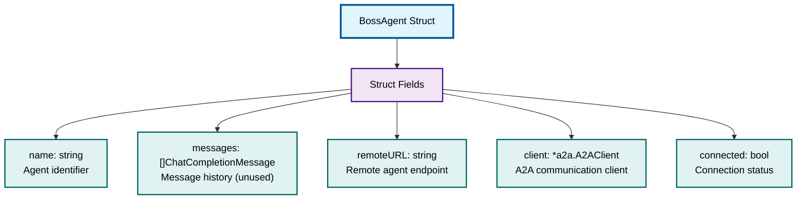

# BossAgent Struct Details

⬅️ **Back to:** [Boss Agent Schema](100-boss-agent-schema.md)

## BossAgent Struct Definition

The `BossAgent` struct (<a href="/dungeon-master/agents/boss.agent.go#L18">lines 18-24</a>) implements the `mu.Agent` interface for remote agent communication.



## Struct Definition

```go
type BossAgent struct {
    name      string                                      // Agent identifier
    messages  []openai.ChatCompletionMessageParamUnion   // Message history (unused)
    remoteURL string                                      // Remote agent endpoint
    client    *a2a.A2AClient                             // A2A communication client
    connected bool                                        // Connection status
}
```


## Interface Implementation Strategy

### Implemented Methods

The following methods are properly implemented:

#### 🤚🤚🤚 RunStream() (<a href="/dungeon-master/agents/boss.agent.go#L162">lines 162-207</a>)
Main communication method - see [A2A Communication Details](103-boss-agent-a2a.md)

#### GetName() (<a href="/dungeon-master/agents/boss.agent.go#L117">lines 117-119</a>)
```go
func (b *BossAgent) GetName() string {
    return b.name
}
```

#### GetModel() (<a href="/dungeon-master/agents/boss.agent.go#L112">lines 112-114</a>)
```go
func (b *BossAgent) GetModel() shared.ChatModel {
    return "Remote Model"
}
```

#### IsConnected() (<a href="/dungeon-master/agents/boss.agent.go#L52">lines 52-54</a>)
```go
func (b *BossAgent) IsConnected() bool {
    return b.connected
}
```


### Unimplemented Methods

Most other `mu.Agent` interface methods are stubbed.

**Rationale**: Boss agent is specialized for remote communication only. Local message management, tool detection, and embedding capabilities are not needed.

## Design Patterns

### Facade Pattern
The `BossAgent` acts as a facade over the complex A2A communication protocol, providing a simple `mu.Agent` interface.

### Adapter Pattern
Adapts the remote agent service (with its own protocol) to fit the local `mu.Agent` interface expected by the dungeon master.

### Minimalist Implementation
Only implements the bare minimum required for the boss agent's role in the game, avoiding unnecessary complexity.

---

⬅️ **Back to:** [Boss Agent Schema](100-boss-agent-schema.md)