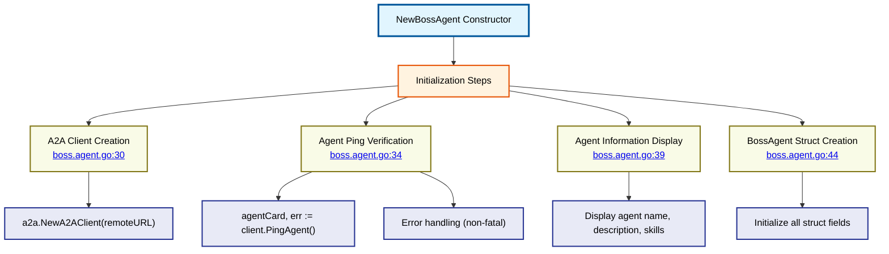

# NewBossAgent Constructor Details

⬅️ **Back to:** [Boss Agent Schema](100-boss-agent-schema.md)

## Constructor Overview

The `NewBossAgent` function (<a href="/dungeon-master/agents/boss.agent.go#L27">lines 27-50</a>) creates and initializes a new boss agent instance with remote communication capabilities.



## Function Signature

```go
func NewBossAgent(name string, remoteURL string) mu.Agent
```

### Parameters
- **name** (`string`): Identifier for the boss agent
- **remoteURL** (`string`): HTTP endpoint of the remote agent service

### Return Value
- **mu.Agent**: Interface implementation pointing to the newly created `BossAgent` instance

## Initialization Process

### Step 1: A2A Client Creation (<a href="/dungeon-master/agents/boss.agent.go#L30">line 30</a>)

```go
client := a2a.NewA2AClient(remoteURL)
```

**Purpose**: Creates the Agent-to-Agent communication client
- **Input**: Remote service URL
- **Output**: Configured A2A client instance
- **Responsibility**: Handles all HTTP communication with the remote service

### Step 2: Agent Ping Verification (<a href="/dungeon-master/agents/boss.agent.go#L33">lines 33-42</a>)

```go
fmt.Println("🔍 Pinging agent...")
agentCard, err := client.PingAgent()
if err != nil {
    fmt.Printf("❌ Failed to ping agent: %v\n", err)
}
```

**Purpose**: Verifies connectivity and retrieves agent information
- **Operation**: Sends ping request to remote service
- **Success**: Retrieves agent metadata (name, description, skills)
- **Failure**: Logs error but continues initialization (non-fatal)
- **AgentCard**: Contains remote agent's self-description

### Step 3: Agent Information Display (<a href="/dungeon-master/agents/boss.agent.go#L39">lines 39-42</a>)

```go
fmt.Printf("✅ Connected to agent: %s\n", agentCard.Name)
fmt.Printf("📝 Description: %s\n", agentCard.Description)
fmt.Printf("🔧 Available skills: %v\n", len(agentCard.Skills))
fmt.Println()
```

**Purpose**: Provides visual feedback about the connected remote agent
- **Agent Name**: Displays the remote agent's self-reported name
- **Description**: Shows the remote agent's purpose/description
- **Skills Count**: Number of available skills on the remote agent
- **User Experience**: Confirms successful connection with detailed info

### Step 4: BossAgent Struct Creation (<a href="/dungeon-master/agents/boss.agent.go#L44">lines 44-49</a>)

```go
return &BossAgent{
    name:      name,
    messages:  []openai.ChatCompletionMessageParamUnion{},
    remoteURL: remoteURL,
    client:    client,
}
```

**Purpose**: Creates and returns the initialized BossAgent instance

#### Field Initialization
- **name**: Uses provided parameter (local identifier)
- **messages**: Empty slice (interface compliance)
- **remoteURL**: Stores endpoint for reference
- **client**: Configured A2A client
- **connected**: Defaults to `false` (zero value)

## Usage Context

### Environment Integration
Typically called from main dungeon master initialization:

```go
bossAgent := agents.NewBossAgent(
    helpers.GetEnvOrDefault("BOSS_NAME", "Boss"),
    helpers.GetEnvOrDefault("BOSS_REMOTE_AGENT_URL", "http://localhost:8080/agent/boss"),
)
```

### Configuration Sources
- **BOSS_NAME**: Environment variable for agent name
- **BOSS_REMOTE_AGENT_URL**: Environment variable for service endpoint
- **Defaults**: Fallback values if environment variables not set


### Development Workflow
1. Start remote boss agent service
2. Configure environment variables
3. Initialize dungeon master with boss agent
4. Verify ping success in console output

---

⬅️ **Back to:** [Boss Agent Schema](100-boss-agent-schema.md)