# A2A Communication Protocol Details

⬅️ **Back to:** [Boss Agent Schema](100-boss-agent-schema.md)

## A2A Communication Overview

The Agent-to-Agent (A2A) communication protocol enables the Boss Agent to interact with remote agent services using structured HTTP requests and streaming responses.

```mermaid
flowchart TD
    A2AComm[A2A Communication]:::main
    A2AComm --> RunStream[RunStream Implementation]:::runstream
    A2AComm --> StreamingResponse[Streaming Response]:::streaming

    RunStream --> MessageExtraction["Extract Last Message<br/><a href='/dungeon-master/agents/boss.agent.go#L164'>boss.agent.go:164</a>"]:::step
    RunStream --> RequestCreation["Create Task Request<br/><a href='/dungeon-master/agents/boss.agent.go#L167'>boss.agent.go:167</a>"]:::step
    RunStream --> StreamSend["Send Streaming Request<br/><a href='/dungeon-master/agents/boss.agent.go#L191'>boss.agent.go:191</a>"]:::step
    RunStream --> ResponseProcess["Process Response<br/><a href='/dungeon-master/agents/boss.agent.go#L200'>boss.agent.go:200</a>"]:::step



    StreamingResponse --> Callback["Streaming Callback<br/>Real-time processing"]:::callback
    StreamingResponse --> FinalResponse["Final Response Extraction"]:::final

    classDef main fill:#e1f5fe,stroke:#01579b,stroke-width:3px,color:#000
    classDef protocol fill:#f3e5f5,stroke:#4a148c,stroke-width:2px,color:#000
    classDef runstream fill:#fff3e0,stroke:#e65100,stroke-width:2px,color:#000
    classDef task fill:#e8f5e8,stroke:#1b5e20,stroke-width:2px,color:#000
    classDef streaming fill:#fce4ec,stroke:#880e4f,stroke-width:2px,color:#000
    classDef jsonrpc fill:#e0f2f1,stroke:#00695c,stroke-width:2px,color:#000
    classDef http fill:#f9fbe7,stroke:#827717,stroke-width:2px,color:#000
    classDef format fill:#e8eaf6,stroke:#283593,stroke-width:2px,color:#000
    classDef step fill:#ffebee,stroke:#c62828,stroke-width:2px,color:#000
    classDef field fill:#e4f7ff,stroke:#0277bd,stroke-width:2px,color:#000
    classDef submessage fill:#f1f8e9,stroke:#33691e,stroke-width:2px,color:#000
    classDef metadata fill:#fff8e1,stroke:#f57f17,stroke-width:2px,color:#000
    classDef msgfield fill:#f3e5f5,stroke:#4a148c,stroke-width:2px,color:#000
    classDef content fill:#e0f2f1,stroke:#00695c,stroke-width:2px,color:#000
    classDef callback fill:#f9fbe7,stroke:#827717,stroke-width:2px,color:#000
    classDef final fill:#e8eaf6,stroke:#283593,stroke-width:2px,color:#000
    classDef status fill:#ffebee,stroke:#c62828,stroke-width:2px,color:#000
```



## RunStream Method Implementation

The `RunStream` method (<a href="/dungeon-master/agents/boss.agent.go#L162">lines 162-207</a>) is the core communication interface for the Boss Agent.

### Method Signature
```go
func (b *BossAgent) RunStream(Messages []openai.ChatCompletionMessageParamUnion, callBack func(content string) error) (string, error)
```

### Implementation Flow

#### Step 1: Message Extraction (<a href="/dungeon-master/agents/boss.agent.go#L164">line 164</a>)
```go
lastMessage := Messages[len(Messages)-1]
```

**Purpose**: Extracts the most recent user message from the conversation
- **Input**: Array of chat completion messages
- **Processing**: Takes the last message (most recent)
- **Assumption**: Last message contains user input for the boss

#### Step 2: Task Request Creation (<a href="/dungeon-master/agents/boss.agent.go#L167-L185">lines 167-185</a>)
```go
taskRequest := a2a.TaskRequest{
    ID:             fmt.Sprintf("task-%d", time.Now().Unix()),
    JSONRpcVersion: "2.0",
    Method:         "message/send",
    Params: a2a.AgentMessageParams{
        Message: a2a.AgentMessage{
            Role: "user",
            Parts: []a2a.TextPart{
                {
                    Text: *lastMessage.GetContent().AsAny().(*string),
                    Type: "text",
                },
            },
        },
        MetaData: map[string]any{
            "skill": "ask_for_something",
        },
    },
}
```

#### Step 3: Streaming Request Transmission (<a href="/dungeon-master/agents/boss.agent.go#L187-L195">lines 187-195</a>)
```go
fmt.Printf("🚀 Sending streaming task request: %s\n", taskRequest.ID)
fmt.Println("🌊 Streaming response:")

response, err := b.client.SendToAgentStream(taskRequest, callBack)
if err != nil {
    fmt.Printf("\n❌ Failed to send streaming request: %v\n", err)
    return "", err
}
```

#### Step 4: Response Processing (<a href="/dungeon-master/agents/boss.agent.go#L196-L206">lines 196-206</a>)
```go
fmt.Println()
fmt.Printf("✅ Task completed: %s\n", response.ID)
fmt.Printf("🎯 Status: %s\n", response.Result.Status.State)

if len(response.Result.History) > 0 {
    fullText := response.Result.History[0].Parts[0].Text
    return fullText, nil
} else {
    return "", nil
}
```

## Task Request Structure

### Core Request Fields

#### Request ID Generation
```go
ID: fmt.Sprintf("task-%d", time.Now().Unix())
```
- **Format**: `task-{unix_timestamp}`
- **Purpose**: Unique identification for request tracking
- **Example**: `task-1699123456`

#### JSON-RPC Compliance
```go
JSONRpcVersion: "2.0"
Method:         "message/send"
```
- **Protocol**: JSON-RPC 2.0 standard
- **Method**: Standardized `message/send` operation
- **Compatibility**: Ensures protocol compliance

### Message Parameters Structure

#### AgentMessage Format
```go
Message: a2a.AgentMessage{
    Role: "user",
    Parts: []a2a.TextPart{
        {
            Text: *lastMessage.GetContent().AsAny().(*string),
            Type: "text",
        },
    },
}
```

**Components**:
- **Role**: Always "user" (from dungeon master perspective)
- **Parts**: Array of text parts (currently single text part)
- **Text**: Extracted content from OpenAI message
- **Type**: Content type identifier ("text")

#### MetaData Configuration
```go
MetaData: map[string]any{
    "skill": "ask_for_something",
}
```

**Purpose**: Provides context for the remote agent
- **Skill**: Specifies which capability to invoke
- **Extensible**: Can include additional context parameters
- **Remote Routing**: Helps remote agent choose appropriate handler

## Streaming Response Handling

### Real-time Callback Processing
```go
response, err := b.client.SendToAgentStream(taskRequest, callBack)
```

**Flow**:
1. **Request Transmission**: Sends structured request to remote service
2. **Stream Initiation**: Remote service begins streaming response
3. **Callback Execution**: Each response chunk triggers provided callback
4. **Real-time Display**: User sees response as it's generated

### Response Structure Analysis

#### Successful Response Processing
```go
if len(response.Result.History) > 0 {
    fullText := response.Result.History[0].Parts[0].Text
    return fullText, nil
}
```

**Response Hierarchy**:
- **response.Result**: Main result container
- **History**: Array of conversation history
- **Parts**: Text parts within each history entry
- **Text**: Final extracted response text

#### Status Information
```go
fmt.Printf("✅ Task completed: %s\n", response.ID)
fmt.Printf("🎯 Status: %s\n", response.Result.Status.State)
```

**Tracking**:
- **Task ID**: Matches request ID for correlation
- **Status State**: Execution status from remote agent
- **Completion Confirmation**: Visual feedback for successful processing

## Error Handling Strategy

### Network Communication Errors
```go
if err != nil {
    fmt.Printf("\n❌ Failed to send streaming request: %v\n", err)
    return "", err
}
```

**Approach**: Fail-fast with error propagation
- **Error Context**: Clear error messaging
- **No Retry**: Single attempt per request
- **Error Bubbling**: Propagates error to caller

### Response Validation
```go
if len(response.Result.History) > 0 {
    // Extract response
} else {
    return "", nil
}
```

**Graceful Handling**: Empty response handled as valid but empty result

## Protocol Benefits

### Standardization
- **JSON-RPC 2.0**: Industry-standard protocol
- **Structured Messages**: Consistent format across requests
- **Type Safety**: Strongly-typed message structures

### Flexibility
- **Skill-based Routing**: MetaData enables capability selection
- **Extensible Format**: Easy to add new fields
- **Multi-part Messages**: Support for complex content types

### Performance
- **Streaming Responses**: Real-time user feedback
- **Asynchronous Processing**: Non-blocking communication
- **Connection Reuse**: A2A client manages connection efficiency

## Security Considerations

### Message Content
- **Direct Transmission**: User input passed through unchanged
- **No Sanitization**: Relies on remote service for input validation
- **Trust Model**: Assumes remote service is trusted

### Authentication
- **No Authentication**: Current implementation has no auth layer
- **Network Security**: Relies on network-level security
- **Service Discovery**: URL-based service identification

---

⬅️ **Back to:** [Boss Agent Schema](100-boss-agent-schema.md)