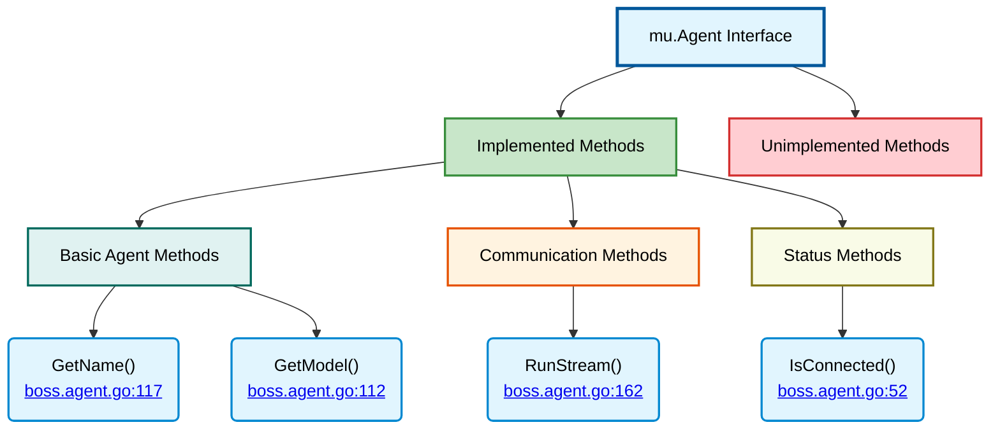

# mu.Agent Interface Implementation

⬅️ **Back to:** [Boss Agent Schema](100-boss-agent-schema.md)

## Interface Overview

The BossAgent implements the `mu.Agent` interface with a selective approach - only essential methods are fully implemented while others are stubbed with panic statements.



## Implemented Methods

### Basic Agent Methods

#### GetName() (<a href="/dungeon-master/agents/boss.agent.go#L117">lines 117-119</a>)
```go
func (b *BossAgent) GetName() string {
    return b.name
}
```
**Purpose**: Returns the agent's identifier
- **Implementation**: Simple field return
- **Usage**: Used by the dungeon master for agent identification
- **Thread-safe**: Read-only operation

#### GetModel() (<a href="/dungeon-master/agents/boss.agent.go#L112">lines 112-114</a>)
```go
func (b *BossAgent) GetModel() shared.ChatModel {
    return "Remote Model"
}
```
**Purpose**: Returns model identifier for the interface
- **Implementation**: Returns constant string "Remote Model"
- **Rationale**: Boss agent doesn't use a local model
- **Interface Compliance**: Satisfies method signature requirement

### Communication Methods

#### RunStream() (<a href="/dungeon-master/agents/boss.agent.go#L162">lines 162-207</a>)
```go
func (b *BossAgent) RunStream(Messages []openai.ChatCompletionMessageParamUnion, callBack func(content string) error) (string, error)
```
**Purpose**: Main communication method for real-time interaction
- **Implementation**: Full A2A protocol implementation
- **Details**: See [A2A Communication Details](103-boss-agent-a2a.md)
- **Returns**: Final response text and any errors
- **Streaming**: Uses callback for real-time response chunks

### Status Methods

#### IsConnected() (<a href="/dungeon-master/agents/boss.agent.go#L52">lines 52-54</a>)
```go
func (b *BossAgent) IsConnected() bool {
    return b.connected
}
```
**Purpose**: Returns connection status to remote service
- **Implementation**: Simple field return
- **Usage**: Health checks and debugging
- **Note**: Status not actively maintained after initialization

## Unimplemented Methods

**Rationale**: Only streaming communication needed; reasoning handled remotely

## Design Philosophy

### Minimalist Implementation
The BossAgent follows a minimalist approach to interface implementation:

**Implemented**: Only methods essential for the boss agent's role
- Basic identification (`GetName`, `GetModel`)
- Core communication (`RunStream`)
- Status checking (`IsConnected`)

**Unimplemented**: Methods not needed for remote communication
- Local state management
- Tool detection and execution
- Embedding generation
- Configuration modification

---

⬅️ **Back to:** [Boss Agent Schema](100-boss-agent-schema.md)