# RAG-Enabled Agents Schema

⬅️ **Back to:** [NPC Agents System](../003-schema-npc-agents-system.md)

## Overview

The RAG-enabled agents (Guard, Sorcerer, Merchant, Healer) follow a common pattern with Retrieval-Augmented Generation capabilities. They use vector embeddings for contextual knowledge and have singleton patterns for efficient resource management.

```mermaid
flowchart TD
    RAGAgent[RAG-Enabled Agent]:::main
    RAGAgent --> Singleton["📄 Singleton Pattern<br/><a href='201-rag-enabled-agents-singleton.md'>201-rag-enabled-agents-singleton.md</a>"]:::singleton
    RAGAgent --> Configuration["📄 Environment Configuration<br/><a href='202-rag-enabled-agents-configuration.md'>202-rag-enabled-agents-configuration.md</a>"]:::config
    RAGAgent --> Embeddings["📄 Vector Embeddings<br/><a href='203-rag-enabled-agents-embeddings.md'>203-rag-enabled-agents-embeddings.md</a>"]:::embeddings
    RAGAgent --> SystemInstructions["📄 System Instructions<br/><a href='204-rag-enabled-agents-system-instructions.md'>204-rag-enabled-agents-system-instructions.md</a>"]:::instructions
    RAGAgent --> AgentCreation["📄 Agent Creation<br/><a href='205-rag-enabled-agents-creation.md'>205-rag-enabled-agents-creation.md</a>"]:::creation

    classDef main fill:#e1f5fe,stroke:#01579b,stroke-width:3px,color:#000
    classDef singleton fill:#f3e5f5,stroke:#4a148c,stroke-width:2px,color:#000
    classDef config fill:#fff3e0,stroke:#e65100,stroke-width:2px,color:#000
    classDef embeddings fill:#e8f5e8,stroke:#1b5e20,stroke-width:2px,color:#000
    classDef instructions fill:#fce4ec,stroke:#880e4f,stroke-width:2px,color:#000
    classDef creation fill:#e0f2f1,stroke:#00695c,stroke-width:2px,color:#000
```

## Architecture Components

### [1. Singleton Pattern](201-rag-enabled-agents-singleton.md)
Thread-safe singleton implementation using `sync.Once` for efficient resource management across all RAG-enabled agents.

### [2. Environment Configuration](202-rag-enabled-agents-configuration.md)
Environment-driven configuration system for agent names, models, temperatures, and file paths.

### [3. Vector Embeddings](203-rag-enabled-agents-embeddings.md)
RAG integration with vector embeddings for contextual knowledge and similarity search capabilities.

### [4. System Instructions](204-rag-enabled-agents-system-instructions.md)
External file-based instruction loading with fallback mechanisms for agent personality definition.

### [5. Agent Creation](205-rag-enabled-agents-creation.md)
`mu.NewAgent` creation process with parameter configuration and ghost agent fallback handling.

## Agent Types

### Guard Agent (`guard.agent.go`)
- **Default Name**: "Huey" (DuckTales reference)
- **Role**: Security and entrance management
- **Default Model**: "ai/qwen2.5:1.5B-F16"

### Sorcerer Agent (`sorcerer.agent.go`)
- **Role**: Magic and spells knowledge
- **Specialized Context**: Magical lore and spellcasting

### Merchant Agent (`merchant.agent.go`)
- **Role**: Trading and item management
- **Specialized Context**: Items, prices, and commerce

### Healer Agent (`healer.agent.go`)
- **Role**: Health and healing services
- **Specialized Context**: Medical knowledge and healing magic

---

⬅️ **Back to:** [NPC Agents System](../003-schema-npc-agents-system.md)