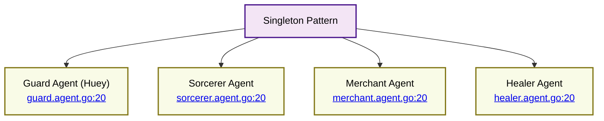

# RAG-Enabled Agents - Singleton Pattern

⬅️ **Back to:** [RAG-Enabled Agents Schema](200-rag-enabled-agents-schema.md)

## Singleton Pattern Implementation

All RAG-enabled agents (Guard, Sorcerer, Merchant, Healer) use the singleton pattern for efficient resource management and thread-safe initialization.



### Code Structure

```go
var (
    agentInstance mu.Agent
    agentOnce     sync.Once
)

func GetAgent(ctx context.Context, client openai.Client) mu.Agent {
    agentOnce.Do(func() {
        agentInstance = createAgent(ctx, client)
    })
    return agentInstance
}
```

### Implementation Details

#### Global Variables
- **`agentInstance`**: Stores the single instance of the agent
- **`agentOnce`**: `sync.Once` ensures initialization happens only once

#### GetAgent Function
- **Thread Safety**: Uses `sync.Once` for safe concurrent access
- **Lazy Loading**: Agent created only when first requested
- **Context Preservation**: Creation context maintained throughout lifecycle

### Benefits

#### Resource Efficiency
- **Single Instance**: One agent instance per type across the application
- **Memory Management**: Avoids duplicate embeddings and model loading
- **Initialization Cost**: One-time setup per agent type

#### Performance Optimizations
- **Concurrent Safety**: Multiple goroutines can safely call `GetAgent`
- **Initialization Guarantee**: Agent creation happens exactly once
- **Resource Conservation**: No unnecessary re-initialization

### Agent Instances

The singleton pattern is implemented in:
- [Guard Agent (Huey)](guard.agent.go:20)
- [Sorcerer Agent](sorcerer.agent.go:20)
- [Merchant Agent](merchant.agent.go:20)
- [Healer Agent](healer.agent.go:20)

---

➡️ **Next:** [Configuration](202-rag-enabled-agents-configuration.md)