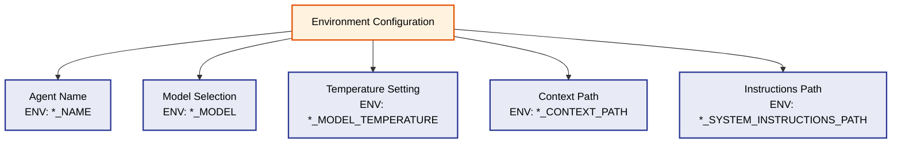

# RAG-Enabled Agents - Configuration

⬅️ **Back to:** [Singleton Pattern](201-rag-enabled-agents-singleton.md)

## Environment Configuration

Each RAG-enabled agent uses environment variables for flexible configuration across different deployment environments.



### Configuration Variables

| Agent | Name | Model | Temperature | Context Path | Instructions Path |
|-------|------|-------|-------------|--------------|-------------------|
| Guard | `GUARD_NAME` | `GUARD_MODEL` | `GUARD_MODEL_TEMPERATURE` | `GUARD_CONTEXT_PATH` | `GUARD_SYSTEM_INSTRUCTIONS_PATH` |
| Sorcerer | `SORCERER_NAME` | `SORCERER_MODEL` | `SORCERER_MODEL_TEMPERATURE` | `SORCERER_CONTEXT_PATH` | `SORCERER_SYSTEM_INSTRUCTIONS_PATH` |
| Merchant | `MERCHANT_NAME` | `MERCHANT_MODEL` | `MERCHANT_MODEL_TEMPERATURE` | `MERCHANT_CONTEXT_PATH` | `MERCHANT_SYSTEM_INSTRUCTIONS_PATH` |
| Healer | `HEALER_NAME` | `HEALER_MODEL` | `HEALER_MODEL_TEMPERATURE` | `HEALER_CONTEXT_PATH` | `HEALER_SYSTEM_INSTRUCTIONS_PATH` |

### Configuration Categories

#### Agent Identity
- **Name**: Configurable agent identity (e.g., "Huey" for Guard)
- **Purpose**: Personalizes interactions and debugging

#### Model Settings
- **Model**: AI model selection for different capabilities
- **Temperature**: Controls creativity/randomness (0.0-1.0)
- **Default Model**: "ai/qwen2.5:1.5B-F16"

#### Content Paths
- **Context Path**: Location of RAG knowledge base files
- **Instructions Path**: Location of system instruction files
- **File Format**: Typically `.txt` or `.md` files

### Environment-Driven Benefits

#### Deployment Flexibility
- **Different Models**: Use different AI models per environment
- **Resource Management**: Smaller models for development, larger for production
- **Cost Control**: Balance performance vs. computational cost

#### Content Management
- **External Files**: Instructions and context separate from code
- **Version Control**: Track changes to agent personalities
- **Hot Swapping**: Update behavior without code changes

#### Development Support
- **Testing**: Use lightweight models for development
- **Debugging**: Adjust temperature for predictable responses
- **Customization**: Agent personalities per deployment

### Default Values

#### Guard Agent Defaults
- **Name**: "Huey" (DuckTales reference)
- **Model**: "ai/qwen2.5:1.5B-F16"
- **Instructions**: "You are an elf guard in a fantasy world."

#### Configuration Loading Pattern
```go
name := helpers.GetEnvOrDefault("GUARD_NAME", "Huey")
model := helpers.GetEnvOrDefault("GUARD_MODEL", "ai/qwen2.5:1.5B-F16")
temperature := helpers.GetEnvOrDefaultFloat64("GUARD_MODEL_TEMPERATURE", 0.2)
```

---

➡️ **Next:** [Embeddings](203-rag-enabled-agents-embeddings.md)