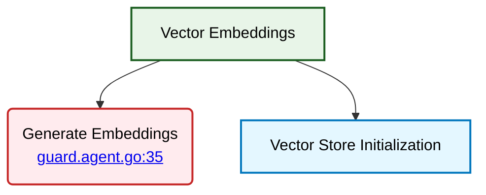

# RAG-Enabled Agents - Embeddings

⬅️ **Back to:** [Configuration](202-rag-enabled-agents-configuration.md)

## Vector Embeddings Integration

RAG-enabled agents use vector embeddings to provide contextual knowledge and improve response relevance through similarity search.



### Embedding Generation Process

#### Core Function Call
```go
errEmbedding := GenerateEmbeddings(ctx, &client, name,
    helpers.GetEnvOrDefault("*_CONTEXT_PATH", ""))
if errEmbedding != nil {
    fmt.Println("🔶 Error generating embeddings:", errEmbedding)
}
```

#### Implementation Details
- **Context Path**: Environment variable specifies knowledge base location
- **Agent Name**: Used for embedding identification and organization
- **Client Integration**: Uses OpenAI client for embedding generation


### Vector Store Integration

#### Initialization Process
- **Document Processing**: Context files converted to vector embeddings
- **Storage**: Embeddings stored for similarity search
- **Agent Association**: Each agent has dedicated embedding space

#### Performance Benefits
- **Fast Retrieval**: Vector similarity search for relevant context
- **Memory Efficiency**: Singleton pattern prevents duplicate embeddings
- **Contextual Responses**: Enhanced agent knowledge through RAG

### Usage in Agent Responses

#### Similarity Search Integration
- **Function**: Used in `GeneratePromptMessagesWithSimilarities`
- **Context Enhancement**: Adds relevant information to agent prompts
- **Knowledge Augmentation**: Extends base model knowledge with domain-specific content

#### Agent-Specific Knowledge
- **Guard**: Security protocols, entrance procedures
- **Sorcerer**: Magical lore, spell information
- **Merchant**: Item catalogs, pricing information
- **Healer**: Medical knowledge, healing procedures


---

➡️ **Next:** [System Instructions](204-rag-enabled-agents-system-instructions.md)