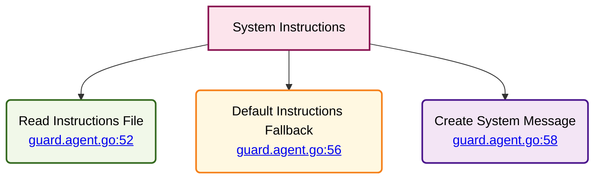

# RAG-Enabled Agents - System Instructions

⬅️ **Back to:** [Embeddings](203-rag-enabled-agents-embeddings.md)

## System Instructions Loading

System instructions define each agent's personality, role, and behavior patterns. They are loaded from external files with fallback mechanisms for robustness.



### Loading Process

#### File Reading
```go
systemInstructionsContent, err := helpers.ReadTextFile(systemInstructionsContentPath)
if err != nil {
    fmt.Println("🔶 Error reading file, using default instructions:", err)
    systemInstructions = openai.SystemMessage("Default instructions")
} else {
    systemInstructions = openai.SystemMessage(systemInstructionsContent)
}
```

#### Path Configuration
- **Environment Variable**: `*_SYSTEM_INSTRUCTIONS_PATH`
- **File Format**: Text or Markdown files
- **External Management**: Instructions separate from code

### Error Handling Strategy

#### Fallback Mechanism
- **Primary**: Load from configured file path
- **Fallback**: Use agent-specific default instructions
- **Error Logging**: Clear error messages for debugging

#### Default Instructions by Agent
- **Guard**: "You are an elf guard in a fantasy world."
- **Sorcerer**: Magic and spellcasting personality
- **Merchant**: Trading and commerce behavior
- **Healer**: Medical and healing role

### System Message Creation

#### OpenAI Integration
```go
systemInstructions = openai.SystemMessage(systemInstructionsContent)
```

#### Message Usage
- **Agent Initialization**: First message in conversation
- **Behavior Definition**: Sets agent personality and constraints
- **Context Setting**: Establishes role and world context

### File Management Benefits

#### External Content Control
- **Version Control**: Track instruction changes
- **Hot Updates**: Modify behavior without code changes
- **Environment-Specific**: Different personalities per deployment

#### Development Flexibility
- **Testing**: Easy instruction modification for testing
- **Customization**: Tailored behaviors for different scenarios
- **Maintenance**: Non-technical users can update personalities

### Code References

#### Key Functions
- [File Reading](guard.agent.go:52)
- [Default Fallback](guard.agent.go:56)
- [System Message Creation](guard.agent.go:58)

#### Integration Points
- **Agent Creation**: Instructions loaded during initialization
- **Message Chain**: First message in agent conversation
- **Error Recovery**: Graceful degradation on file errors

### Instruction File Structure

#### Content Format
- **Plain Text**: Simple personality descriptions
- **Markdown**: Rich formatting for complex instructions
- **Role Definition**: Clear agent role and capabilities
- **Behavioral Guidelines**: Interaction patterns and constraints

#### Example Structure
```
You are [Agent Name], a [Role] in a fantasy dungeon world.

Your responsibilities include:
- [Primary function]
- [Secondary functions]

Your personality traits:
- [Trait 1]
- [Trait 2]

Guidelines for interaction:
- [Guideline 1]
- [Guideline 2]
```

---

➡️ **Next:** [Agent Creation](205-rag-enabled-agents-creation.md)