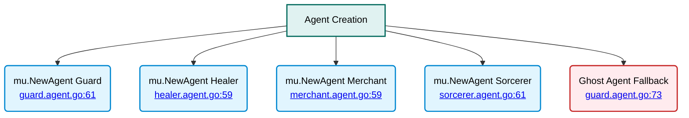

# RAG-Enabled Agents - Agent Creation

⬅️ **Back to:** [System Instructions](204-rag-enabled-agents-system-instructions.md)

## Agent Creation Process

The final step in RAG-enabled agent initialization involves creating the `mu.Agent` instance with all configured parameters and implementing fallback mechanisms for error handling.



### Core Agent Creation

#### mu.NewAgent Function
```go
chatAgent, err := mu.NewAgent(ctx, name,
    mu.WithClient(client),
    mu.WithParams(openai.ChatCompletionNewParams{
        Model:       model,
        Temperature: openai.Opt(temperature),
        Messages: []openai.ChatCompletionMessageParamUnion{
            systemInstructions,
        },
    }),
)
```

#### Parameter Configuration
- **Context**: Inherited from singleton creation
- **Client**: OpenAI client for API communication
- **Model**: Configured AI model
- **Temperature**: Creativity/randomness setting
- **Messages**: System instructions as first message

### Error Handling and Fallback

#### Ghost Agent Creation
```go
if err != nil {
    fmt.Println("🔶 Error creating agent:", err)
    ghostAgent := mu.NewTestAgent(fmt.Sprintf("[Ghost] %s", name))
    return ghostAgent
}
```

#### Fallback Strategy
- **Ghost Agent**: Test agent created if real agent fails
- **Name Preservation**: Maintains expected name with "[Ghost]" prefix
- **Error Logging**: Provides specific error information
- **Graceful Degradation**: System continues operating

### Agent Configuration Details

#### Required Parameters
- **Name**: Agent identity for interactions
- **Client**: OpenAI API client instance
- **Model**: AI model specification
- **Temperature**: Response creativity control
- **System Instructions**: Personality and behavior definition


### Agent Lifecycle

#### Initialization
- **One-time Setup**: Singleton pattern ensures single creation
- **Resource Loading**: Embeddings and instructions prepared
- **Client Configuration**: OpenAI API client ready

#### Operation
- **Chat Completion**: Process user messages
- **RAG Enhancement**: Context-aware responses
- **Memory Management**: Efficient resource usage

---

⬅️ **Back to:** [RAG-Enabled Agents Schema](200-rag-enabled-agents-schema.md)