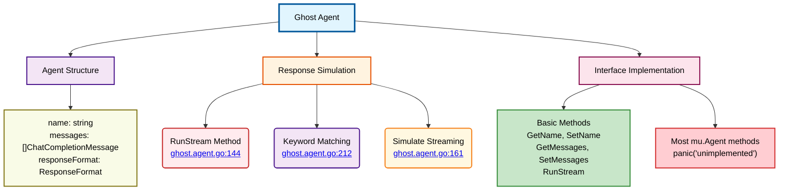

# Ghost Agent Schema

⬅️ **Back to:** [NPC Agents System](../003-schema-npc-agents-system.md)

## Overview

The Ghost Agent is a test/simulation agent that mimics AI behavior without actual AI processing. It's designed for development and testing purposes, providing predictable responses based on keyword matching.

## Key Features

### Structure
Simple struct with three fields for basic agent functionality:
- **name**: Agent identifier
- **messages**: Message history storage
- **responseFormat**: Response format configuration

### Response Simulation
- **Keyword Matching**: Predefined responses for common keywords (hello, weather, code, etc.)
- **Streaming Simulation**: Word-by-word delivery with 50ms delays
- **Default Fallback**: Always provides a response when no keywords match

### Interface Implementation
- **Implemented**: Basic methods like GetName, SetName, GetMessages, RunStream
- **Unimplemented**: Most mu.Agent methods panic with "unimplemented"

## Usage

**Development Tool**: Safe testing without AI costs or dependencies
**Predictable Behavior**: Consistent responses for automated testing
**Fallback Agent**: Used when real agents fail to create ([guard.agent.go:73](guard.agent.go:73))

## Code References

- **Constructor**: [ghost.agent.go:19](ghost.agent.go:19)
- **Main Method**: [ghost.agent.go:144](ghost.agent.go:144)
- **Keyword Responses**: [ghost.agent.go:212](ghost.agent.go:212)

---

⬅️ **Back to:** [NPC Agents System](../003-schema-npc-agents-system.md)