# Vector Stores and RAG System Schema

⬅️ **Back to:** [NPC Agents System](../003-schema-npc-agents-system.md)

## Overview

The `stores.go` file implements the Retrieval-Augmented Generation (RAG) system for all NPC agents. It manages vector stores, generates embeddings, and provides similarity search capabilities for enhanced agent responses.

```mermaid
flowchart TD
    RAGSystem[RAG System]:::main
    RAGSystem --> GlobalStore["📄 Global Agent Stores<br/><a href='101-stores-global-stores.md'>101-stores-global-stores.md</a>"]:::global
    RAGSystem --> EmbeddingGeneration["📄 Embedding Generation<br/><a href='102-stores-embedding-generation.md'>102-stores-embedding-generation.md</a>"]:::embedding
    RAGSystem --> SimilaritySearch["📄 Similarity Search<br/><a href='103-stores-similarity-search.md'>103-stores-similarity-search.md</a>"]:::search

    classDef main fill:#e1f5fe,stroke:#01579b,stroke-width:3px,color:#000
    classDef global fill:#f3e5f5,stroke:#4a148c,stroke-width:2px,color:#000
    classDef embedding fill:#fff3e0,stroke:#e65100,stroke-width:2px,color:#000
    classDef search fill:#e8f5e8,stroke:#1b5e20,stroke-width:2px,color:#000
```

## System Components

### [1. Global Agent Stores](101-stores-global-stores.md)
Centralized registry managing vector stores for all agents through a global map structure.

### [2. Embedding Generation](102-stores-embedding-generation.md)
Process for creating and managing vector embeddings from agent knowledge bases with intelligent caching.

### [3. Similarity Search](103-stores-similarity-search.md)
Real-time similarity search capabilities for RAG-enhanced agent responses using cosine similarity.

## Key Features

### Persistent Storage
Vector stores saved as JSON files with naming pattern: `{agent_name}_vector_store.json`

### Environment Configuration
- **`VECTOR_STORES_PATH`**: Storage directory (default: "./data")
- **`EMBEDDING_MODEL`**: Embedding model (default: "ai/mxbai-embed-large:latest")

### Agent Integration
- **Initialization**: Embeddings generated during agent creation
- **Response Enhancement**: Similarity search provides contextual knowledge
- **Performance**: Memory-resident stores for fast access

## Agent Stores

### Supported Agents
- **huey_vector_store.json**: Guard agent knowledge
- **sorcerer_vector_store.json**: Magical lore and spells
- **merchant_vector_store.json**: Trading and commerce information
- **healer_vector_store.json**: Medical and healing knowledge

---

⬅️ **Back to:** [NPC Agents System](../003-schema-npc-agents-system.md)