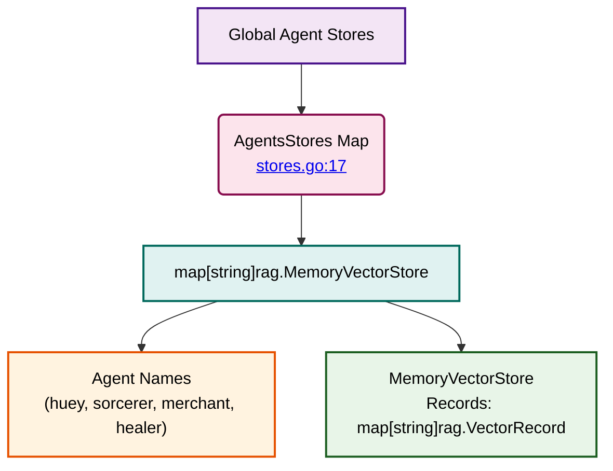

# Vector Stores - Global Agent Stores

⬅️ **Back to:** [Vector Stores Schema](100-stores-schema.md)

## Global Agent Stores

The RAG system uses a global registry to manage vector stores for all agents through a centralized map structure.



## Implementation Details

### Global Variable Declaration
```go
var AgentsStores = make(map[string]rag.MemoryVectorStore)
```

### Structure and Purpose

#### Map Structure
- **Key**: Agent name (string) - lowercase agent identifier
- **Value**: `rag.MemoryVectorStore` containing embedded knowledge
- **Scope**: Package-level variable accessible to all functions

#### Agent Registration
Each agent gets its own vector store entry:
- **"huey"**: Guard agent's knowledge base
- **"sorcerer"**: Sorcerer agent's magical knowledge
- **"merchant"**: Merchant agent's trading information
- **"healer"**: Healer agent's medical knowledge

#### Memory Vector Store Structure
```go
rag.MemoryVectorStore{
    Records: map[string]rag.VectorRecord{
        // Vector records with embeddings and content
    }
}
```

### Usage Pattern

#### Store Initialization
```go
AgentsStores[name] = rag.MemoryVectorStore{
    Records: make(map[string]rag.VectorRecord),
}
```

#### Store Retrieval
```go
store := AgentsStores[agentName]
```

#### Store Persistence
Each store can be saved to JSON files for persistence between application runs.

---

➡️ **Next:** [Embedding Generation](102-stores-embedding-generation.md)