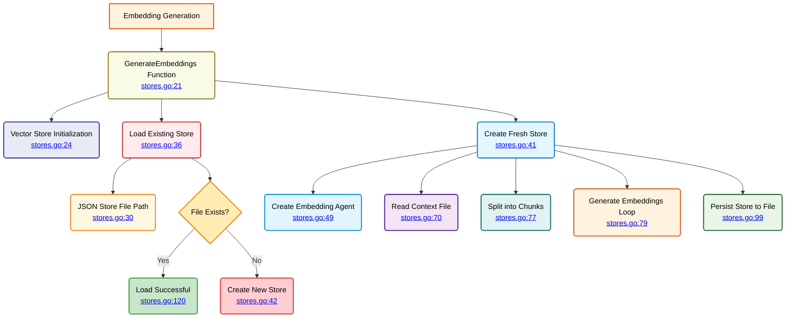

# Vector Stores - Embedding Generation

⬅️ **Back to:** [Global Agent Stores](101-stores-global-stores.md)

## Embedding Generation Process

The `GenerateEmbeddings` function creates and manages vector embeddings for agent knowledge bases, with intelligent caching and persistence.



## Function Signature

```go
func GenerateEmbeddings(ctx context.Context, client *openai.Client, name string, contextInstructionsContentPath string) error
```

### Parameters
- **ctx**: Context for operation control
- **client**: OpenAI client for embedding generation
- **name**: Agent name (used for store identification)
- **contextInstructionsContentPath**: Path to agent's knowledge base file

## Process Flow

### 1. Store Initialization
```go
AgentsStores[name] = rag.MemoryVectorStore{
    Records: make(map[string]rag.VectorRecord),
}
store := AgentsStores[name]
```

### 2. File Path Construction
```go
jsonStoreFilePath := helpers.GetEnvOrDefault("VECTOR_STORES_PATH", "./data") + "/" +
    strings.ToLower(name) + "_vector_store.json"
```

**Path Pattern**: `{VECTOR_STORES_PATH}/{agent_name}_vector_store.json`

### 3. Existing Store Loading
If a persisted store exists, it's loaded directly:
```go
if err == nil {
    fmt.Println("✅ Vector store loaded successfully with", len(store.Records), "records")
    return nil
}
```

### 4. Fresh Store Creation

#### Embedding Agent Setup
```go
embeddingAgent, err := mu.NewAgent(ctx, "vector-agent",
    mu.WithClient(*client),
    mu.WithEmbeddingParams(
        openai.EmbeddingNewParams{
            Model: helpers.GetEnvOrDefault("EMBEDDING_MODEL", "ai/mxbai-embed-large:latest"),
        },
    ),
)
```

#### Content Processing
```go
contextInstructionsContent, err := helpers.ReadTextFile(contextInstructionsContentPath)
chunks := rag.SplitMarkdownBySections(contextInstructionsContent)
```

#### Embedding Generation Loop
```go
for idx, chunk := range chunks {
    embeddingVector, err := embeddingAgent.GenerateEmbeddingVector(chunk)
    if err != nil {
        return err
    }
    _, errSave := store.Save(rag.VectorRecord{
        Prompt:    chunk,
        Embedding: embeddingVector,
    })
    if errSave != nil {
        return errSave
    }
}
```

#### Store Persistence
```go
err = store.Persist(jsonStoreFilePath)
if err != nil {
    fmt.Println("🔶 Error saving vector store:", err)
    return err
}
```

## Configuration

### Environment Variables
- **`VECTOR_STORES_PATH`**: Directory for storing vector databases (default: "./data")
- **`EMBEDDING_MODEL`**: Model for generating embeddings (default: "ai/mxbai-embed-large:latest")

---

➡️ **Next:** [Similarity Search](103-stores-similarity-search.md)