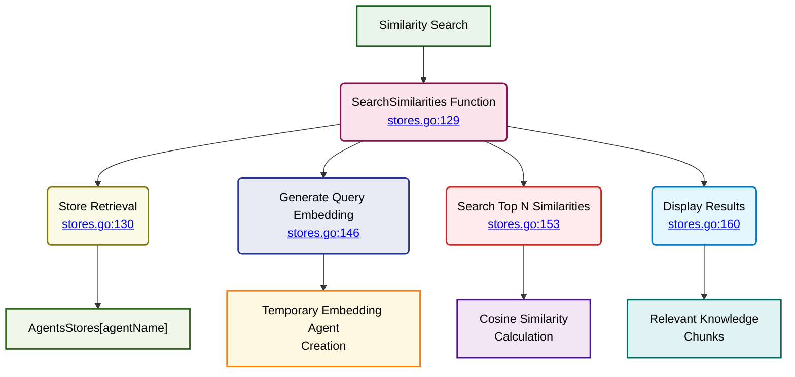

# Vector Stores - Similarity Search

⬅️ **Back to:** [Embedding Generation](102-stores-embedding-generation.md)

## Similarity Search System

The `SearchSimilarities` function provides real-time similarity search capabilities for RAG-enhanced agent responses.



## Function Signature

```go
func SearchSimilarities(ctx context.Context, client *openai.Client, agentName string, input string, threshold float64, topN int) ([]rag.VectorRecord, error)
```

### Parameters
- **ctx**: Context for operation control
- **client**: OpenAI client for embedding generation
- **agentName**: Target agent's store identifier
- **input**: User query/input to search for
- **threshold**: Minimum similarity score (0.0-1.0)
- **topN**: Maximum number of results to return

### Returns
- **[]rag.VectorRecord**: Array of matching knowledge chunks
- **error**: Error if search fails

## Process Flow

### 1. Store Retrieval
```go
store := AgentsStores[agentName]
```
Direct lookup from global agents store map.

### 2. Embedding Agent Creation
```go
embeddingAgent, err := mu.NewAgent(ctx, "vector-agent",
    mu.WithClient(*client),
    mu.WithEmbeddingParams(
        openai.EmbeddingNewParams{
            Model: helpers.GetEnvOrDefault("EMBEDDING_MODEL", "ai/mxbai-embed-large:latest"),
        },
    ),
)
```
Creates temporary agent for query embedding generation.

### 3. Query Embedding Generation
```go
questionEmbeddingVector, err := embeddingAgent.GenerateEmbeddingVector(input)
if err != nil {
    return nil, err
}
questionRecord := rag.VectorRecord{Embedding: questionEmbeddingVector}
```
Converts user input into vector representation.

### 4. Similarity Search
```go
similarities, err := store.SearchTopNSimilarities(questionRecord, threshold, topN)
if err != nil {
    return nil, err
}
```
Performs cosine similarity search against stored knowledge.

### 5. Results Display
```go
fmt.Println("📝 Similarities found:", len(similarities))
for _, similarity := range similarities {
    fmt.Println("✅ CosineSimilarity:", similarity.CosineSimilarity, "Chunk:", similarity.Prompt)
}
```
Logs matching results with similarity scores.

## Search Parameters

### Threshold Configuration
- **Range**: 0.0 to 1.0
- **0.0**: No filtering (all results)
- **0.5**: Moderate similarity required
- **0.8**: High similarity required
- **1.0**: Exact match only

### Top-N Limiting
- **Purpose**: Controls result set size
- **Performance**: Prevents overwhelming responses
- **Typical Values**: 3-10 results

## Integration with RAG System

### Usage in Main Loop
Called from `GeneratePromptMessagesWithSimilarities`:
```go
similarities, err := agents.SearchSimilarities(ctx, client, agentName, input,
    similarityLimit, maxResults)
```

### Context Enhancement
Results are used to enhance agent responses:
```go
if len(similarities) > 0 {
    similaritiesMessage := "Here is some context that might be useful:\n"
    for _, similarity := range similarities {
        similaritiesMessage += fmt.Sprintf("- %s\n", similarity.Prompt)
    }
}
```

---

⬅️ **Back to:** [Vector Stores Schema](100-stores-schema.md)