# End-of-Level Boss Agent Schema

## Overview

The End-of-Level Boss Agent is a **standalone A2A (Agent-to-Agent) server implementation** that provides the final boss encounter functionality for the dungeon game. Unlike other NPC agents, this agent runs as an independent service and communicates via HTTP using the A2A protocol with streaming capabilities.

```mermaid
flowchart TD
    BossService[End-of-Level Boss Service]:::main
    BossService --> MainApp[Main Application]:::app
    BossService --> BossAgent[Boss Agent Implementation]:::agent
    BossService --> A2AServer[A2A Server with Streaming]:::server
    BossService --> RAGSystem[RAG System Integration]:::rag

    MainApp --> AppStructure["📄 Application Structure<br/><a href='101-boss-service-main.md'>101-boss-service-main.md</a>"]:::detail
    BossAgent --> AgentDetails["🧙‍♂️ Boss Agent Details<br/><a href='102-boss-agent-implementation.md'>102-boss-agent-implementation.md</a>"]:::detail
    A2AServer --> ServerDetails["🔄 A2A Server Details<br/><a href='103-boss-a2a-server.md'>103-boss-a2a-server.md</a>"]:::detail
    RAGSystem --> RAGDetails["🧠 RAG System Details<br/><a href='104-boss-rag-system.md'>104-boss-rag-system.md</a>"]:::detail

    classDef main fill:#e1f5fe,stroke:#01579b,stroke-width:3px,color:#000
    classDef app fill:#f3e5f5,stroke:#4a148c,stroke-width:2px,color:#000
    classDef agent fill:#e8f5e8,stroke:#1b5e20,stroke-width:2px,color:#000
    classDef server fill:#fff3e0,stroke:#e65100,stroke-width:2px,color:#000
    classDef rag fill:#fce4ec,stroke:#880e4f,stroke-width:2px,color:#000
    classDef detail fill:#ffebee,stroke:#c62828,stroke-width:3px,color:#000
```

### Key Components

#### Main Application (`main.go`)
- **Environment Configuration**: LLM URL, MCP Host, HTTP Port setup
- **Agent Initialization**: Creates and configures the boss agent instance
- **A2A Server Setup**: Establishes streaming-capable Agent-to-Agent server
- **RAG Integration**: Implements similarity search for context-aware responses

#### Boss Agent (`agents/boss.agent.go`)
- **Singleton Pattern**: Ensures single instance of the boss agent
- **LLM Integration**: Configurable language model with temperature settings
- **System Instructions**: File-based instruction loading for character behavior
- **Fallback Mechanism**: Ghost agent fallback for error scenarios

#### Supporting Components
- **Vector Store**: RAG-enabled context storage and similarity search
- **Ghost Agent**: Fallback agent for error scenarios
- **Streaming Support**: Real-time response delivery

### Configuration

Environment variables for service setup:

| Variable | Default | Purpose |
|----------|---------|---------|
| `MODEL_RUNNER_BASE_URL` | `http://localhost:12434/engines/llama.cpp/v1` | LLM service endpoint |
| `MCP_HOST` | `http://localhost:9011/mcp` | MCP service host |
| `BOSS_REMOTE_AGENT_HTTP_PORT` | `8080` | A2A server port |
| `BOSS_NAME` | `Louie` | Boss character name |
| `BOSS_DESCRIPTION` | `A wise and powerful Sphinx in a fantasy world.` | Boss description |
| `BOSS_MODEL` | `ai/qwen2.5:1.5B-F16` | LLM model identifier |
| `BOSS_MODEL_TEMPERATURE` | `0.0` | Model creativity setting |
| `BOSS_CONTEXT_PATH` | `` | Context file for RAG |
| `BOSS_SYSTEM_INSTRUCTIONS_PATH` | `` | System instructions file |
| `SIMILARITY_LIMIT` | `0.5` | RAG similarity threshold |
| `SIMILARITY_MAX_RESULTS` | `2` | Maximum RAG results |

### Service Architecture

The boss service operates as a standalone microservice that:

1. **Initializes Environment**: Loads configuration from environment variables
2. **Creates Boss Agent**: Sets up the LLM-powered boss character with RAG
3. **Starts A2A Server**: Provides HTTP endpoint for agent communication
4. **Handles Streaming**: Delivers real-time responses to client requests
5. **Integrates RAG**: Enhances responses with contextual information

### Communication Protocol

The service uses the A2A (Agent-to-Agent) protocol with:
- **JSON-RPC 2.0**: Standard protocol compliance
- **Streaming Responses**: Real-time content delivery
- **Skill-based Routing**: Metadata-driven request handling
- **Task Tracking**: Unique request identification

### Usage in Game

Players interact with the end-of-level boss through:
- **Remote Communication**: Via other game services using A2A protocol
- **Streaming Responses**: Real-time dialogue delivery
- **Context Awareness**: RAG-enhanced responses based on game context
- **Character Consistency**: System instruction-driven behavior

---