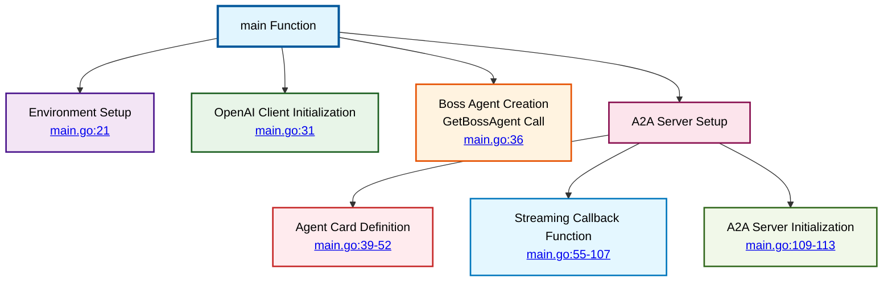
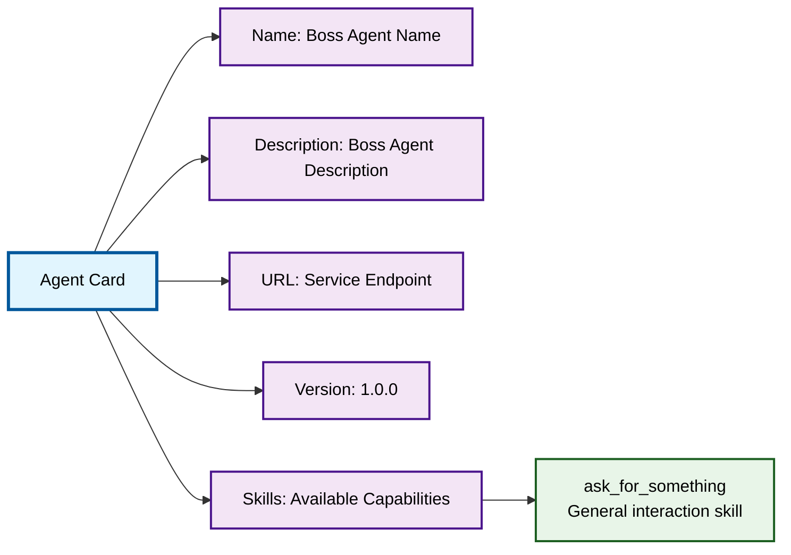
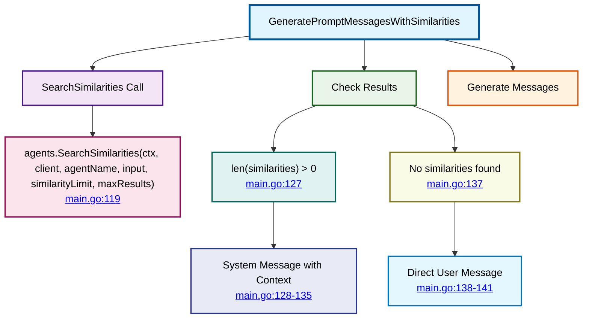

# Boss Service Main Application

⬅️ **Back to:** [Boss Agent Schema](100-boss-agent-schema.md)

## Application Structure Overview

The main application (`main.go`) serves as the entry point for the End-of-Level Boss service, orchestrating the initialization and startup of the A2A server with streaming capabilities.



## Environment Configuration

### Core Service URLs
The application configures essential service endpoints:

```go
llmURL := helpers.GetEnvOrDefault("MODEL_RUNNER_BASE_URL", "http://localhost:12434/engines/llama.cpp/v1")
mcpHost := helpers.GetEnvOrDefault("MCP_HOST", "http://localhost:9011/mcp")
```

**Configuration Details**:
- **LLM URL**: Language model service endpoint for AI capabilities
- **MCP Host**: Model Control Protocol service for model management
- **Default Values**: Provide fallback for local development setup

### RAG System Parameters
```go
similaritySearchLimit := helpers.StringToFloat(helpers.GetEnvOrDefault("SIMILARITY_LIMIT", "0.5"))
similaritySearchMaxResults := helpers.StringToInt(helpers.GetEnvOrDefault("SIMILARITY_MAX_RESULTS", "2"))
```

**RAG Configuration**:
- **Similarity Limit**: Threshold for context relevance (0.0-1.0)
- **Max Results**: Maximum number of similar context chunks to retrieve
- **Purpose**: Controls quality and quantity of RAG-enhanced responses

### Service Port Setup
```go
httpPort := helpers.GetEnvOrDefault("BOSS_REMOTE_AGENT_HTTP_PORT", "8080")
```

**Port Configuration**:
- **Default Port**: 8080 for A2A server
- **Customizable**: Allows deployment flexibility
- **Service Discovery**: Enables other services to connect

## OpenAI Client Initialization

```go
client := openai.NewClient(
    option.WithBaseURL(llmURL),
    option.WithAPIKey(""),
)
```

**Client Setup**:
- **Base URL**: Points to local LLM service instead of OpenAI
- **API Key**: Empty for local deployment (no authentication required)
- **Compatibility**: Uses OpenAI SDK interface with local models

## Agent Card Definition

The Agent Card defines the service's capabilities and metadata:



### Card Structure
```go
agentCard := a2a.AgentCard{
    Name:        bossAgent.GetName(),
    Description: bossAgent.GetDescription(),
    URL:         "http://localhost:" + httpPort,
    Version:     "1.0.0",
    Skills: []map[string]any{
        {
            "id":          "ask_for_something",
            "name":        "Ask for something",
            "description": bossAgent.GetName() + " is using a small language model to answer questions",
        },
    },
}
```

## Streaming Callback Implementation

The streaming callback handles real-time communication with clients:

```mermaid
flowchart TD
    StreamCallback[Streaming Callback Function]:::main
    StreamCallback --> RequestExtract[Extract Task Request]:::extract
    StreamCallback --> MessageParse[Parse User Message]:::parse
    StreamCallback --> SkillRoute[Route by Skill]:::route
    StreamCallback --> RAGSearch[RAG Similarity Search]:::rag
    StreamCallback --> StreamRun[Execute Boss Agent Stream]:::execute
    StreamCallback --> Debug[Debug Mode Handling]:::debug

    RequestExtract --> TaskID["Task ID: task.ID<br/><a href='/dungeon-end-of-level-boss/main.go#L57'>main.go:57</a>"]:::field
    RequestExtract --> UserMsg["User Message: taskRequest.Params.Message.Parts[0].Text<br/><a href='/dungeon-end-of-level-boss/main.go#L59'>main.go:59</a>"]:::field
    RequestExtract --> MetaData["Metadata: taskRequest.Params.MetaData<br/><a href='/dungeon-end-of-level-boss/main.go#L61'>main.go:61</a>"]:::field

    SkillRoute --> AskSkill["ask_for_something<br/>Direct message processing"]:::validskill
    SkillRoute --> InvalidSkill["Invalid Skill<br/>Error response"]:::invalidskill

    RAGSearch --> SimilarityFunc["GeneratePromptMessagesWithSimilarities<br/><a href='/dungeon-end-of-level-boss/main.go#L78'>main.go:78</a>"]:::ragfunc

    StreamRun --> BossRunStream["bossAgent.RunStream<br/><a href='/dungeon-end-of-level-boss/main.go#L85'>main.go:85</a>"]:::stream

    Debug --> DebugCheck["strings.HasPrefix(userPrompt, '/debug')<br/><a href='/dungeon-end-of-level-boss/main.go#L102'>main.go:102</a>"]:::debugcheck
    Debug --> HistoryDisplay["msg.DisplayHistory(bossAgent)<br/><a href='/dungeon-end-of-level-boss/main.go#L103'>main.go:103</a>"]:::history

    classDef main fill:#e1f5fe,stroke:#01579b,stroke-width:3px,color:#000
    classDef extract fill:#f3e5f5,stroke:#4a148c,stroke-width:2px,color:#000
    classDef parse fill:#e8f5e8,stroke:#1b5e20,stroke-width:2px,color:#000
    classDef route fill:#fff3e0,stroke:#e65100,stroke-width:2px,color:#000
    classDef rag fill:#fce4ec,stroke:#880e4f,stroke-width:2px,color:#000
    classDef execute fill:#e0f2f1,stroke:#00695c,stroke-width:2px,color:#000
    classDef debug fill:#f9fbe7,stroke:#827717,stroke-width:2px,color:#000
    classDef field fill:#e8eaf6,stroke:#283593,stroke-width:2px,color:#000
    classDef validskill fill:#e4f7ff,stroke:#0277bd,stroke-width:2px,color:#000
    classDef invalidskill fill:#ffcdd2,stroke:#d32f2f,stroke-width:2px,color:#000
    classDef ragfunc fill:#f1f8e9,stroke:#33691e,stroke-width:2px,color:#000
    classDef stream fill:#fff8e1,stroke:#f57f17,stroke-width:2px,color:#000
    classDef debugcheck fill:#c8e6c9,stroke:#388e3c,stroke-width:2px,color:#000
    classDef history fill:#ffebee,stroke:#c62828,stroke-width:2px,color:#000
```



### Request Processing Flow

#### 1. Task Request Extraction
```go
fmt.Printf("🟢 Processing streaming task request: %s\n", taskRequest.ID)
userMessage := taskRequest.Params.Message.Parts[0].Text
fmt.Printf("🔵 UserMessage: %s\n", userMessage)
fmt.Printf("🟡 TaskRequest Metadata: %v\n", taskRequest.Params.MetaData)
```

#### 2. Skill-based Routing
```go
switch taskRequest.Params.MetaData["skill"] {
case "ask_for_something":
    userPrompt = userMessage
default:
    userPrompt = "Be nice, and explain that " + fmt.Sprintf("%v", taskRequest.Params.MetaData["skill"]) + " is not a valid task ID."
}
```

#### 3. RAG Integration
```go
bossAgentMessages, err := GeneratePromptMessagesWithSimilarities(ctx, &client, bossAgent.GetName(), userPrompt, similaritySearchLimit, similaritySearchMaxResults)
```

#### 4. Streaming Execution
```go
_, err = bossAgent.RunStream(
    bossAgentMessages,
    func(content string) error {
        if content != "" {
            fmt.Print(content)         // Print to console for debugging
            return streamFunc(content) // Stream to client
        }
        return nil // Continue streaming
    })
```

## RAG Similarity Search Function

The `GeneratePromptMessagesWithSimilarities` function enhances responses with contextual information:



### Context Enhancement Logic
When similarities are found:
```go
if len(similarities) > 0 {
    similaritiesMessage := "Here is some context that might be useful:\n"
    for _, similarity := range similarities {
        similaritiesMessage += fmt.Sprintf("- %s\n", similarity.Prompt)
    }
    return []openai.ChatCompletionMessageParamUnion{
        openai.SystemMessage(similaritiesMessage),
        openai.UserMessage(input),
    }, nil
}
```

## A2A Server Startup

The final step initializes and starts the A2A server:

```go
a2aServer := a2a.NewA2AServerWithStreaming(helpers.StringToInt(httpPort), agentCard, agentStreamCallback)
fmt.Println("🚀 Starting A2A server with streaming support on port:", httpPort)
if err := a2aServer.Start(); err != nil {
    fmt.Printf("❌ Failed to start A2A server: %v\n", err)
}
```

**Server Features**:
- **Streaming Support**: Real-time response delivery
- **Agent Card Registration**: Service capability advertisement
- **Callback Integration**: Custom request handling logic
- **Port Configuration**: Flexible deployment options

---

⬅️ **Back to:** [Boss Agent Schema](100-boss-agent-schema.md)