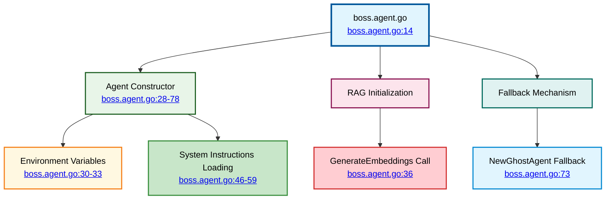
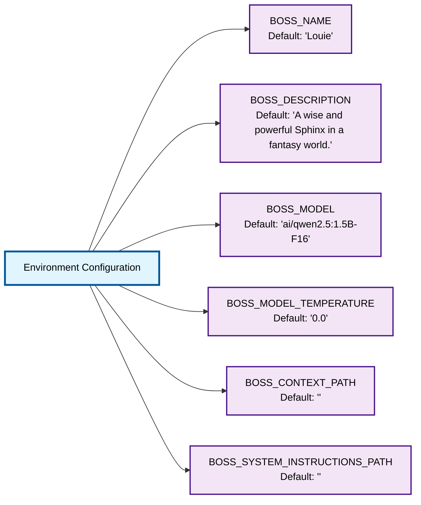
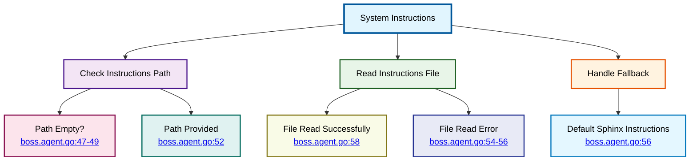

# Boss Agent Implementation

⬅️ **Back to:** [Boss Agent Schema](100-boss-agent-schema.md)

## Boss Agent Overview

The Boss Agent (`agents/boss.agent.go`) implements a singleton-pattern agent that serves as the end-of-level boss character. It integrates LLM capabilities, RAG (Retrieval-Augmented Generation), and fallback mechanisms.



## Singleton Pattern Implementation

### Global Variables
```go
var (
    sorcererAgentInstance mu.Agent
    sorcererAgentOnce     sync.Once
)
```

**Design Notes**:
- **Variable Naming**: Uses `sorcererAgent` naming (legacy from original wizard boss)
- **Thread Safety**: `sync.Once` ensures single initialization in concurrent environment
- **Instance Storage**: Global variable holds the singleton instance

### GetBossAgent Function
```go
func GetBossAgent(ctx context.Context, client openai.Client) mu.Agent {
    sorcererAgentOnce.Do(func() {
        sorcererAgentInstance = createBossAgent(ctx, client)
    })
    return sorcererAgentInstance
}
```

**Function Behavior**:
- **Lazy Initialization**: Agent created only when first requested
- **Thread-Safe**: `sync.Once` guarantees single execution
- **Context Passing**: Forwards context for dependent operations
- **Client Injection**: OpenAI client dependency injection

## Environment Configuration

The agent constructor reads configuration from environment variables:



### Configuration Loading
```go
name := helpers.GetEnvOrDefault("BOSS_NAME", "Louie")
description := helpers.GetEnvOrDefault("BOSS_DESCRIPTION", "A wise and powerful Sphinx in a fantasy world.")
model := helpers.GetEnvOrDefault("BOSS_MODEL", "ai/qwen2.5:1.5B-F16")
temperature := helpers.StringToFloat(helpers.GetEnvOrDefault("BOSS_MODEL_TEMPERATURE", "0.0"))
```

**Configuration Features**:
- **Fallback Values**: Each variable has sensible defaults
- **Type Conversion**: Automatic string-to-float conversion for temperature
- **Character Setup**: Name and description define the boss personality
- **Model Selection**: Configurable LLM model for different capabilities

## RAG System Integration

### Embeddings Generation
```go
errEmbedding := GenerateEmbeddings(ctx, &client, name, helpers.GetEnvOrDefault("BOSS_CONTEXT_PATH", ""))
if errEmbedding != nil {
    fmt.Println("🔶 Error generating embeddings for sorcerer agent:", errEmbedding)
}
```

**RAG Setup Process**:
1. **Context File**: Reads from `BOSS_CONTEXT_PATH` environment variable
2. **Embedding Generation**: Creates vector embeddings for context chunks
3. **Error Handling**: Non-fatal errors - agent continues without RAG if embedding fails
4. **Agent Storage**: Associates embeddings with the boss agent name

### Vector Store Benefits
- **Context Awareness**: Boss can reference relevant lore and game context
- **Enhanced Responses**: Similarity search provides relevant background information
- **Configurable Content**: External files allow easy content updates
- **Performance**: Pre-computed embeddings for fast similarity search

## System Instructions Management



### Instructions Loading Logic
```go
systemInstructionsContentPath := helpers.GetEnvOrDefault("BOSS_SYSTEM_INSTRUCTIONS_PATH", "")
if systemInstructionsContentPath == "" {
    fmt.Println("🔶 No BOSS_SYSTEM_INSTRUCTIONS_PATH provided, using default instructions.")
}

systemInstructionsContent, err := helpers.ReadTextFile(systemInstructionsContentPath)

if err != nil {
    fmt.Println("🔶 Error reading the file, using default instructions:", err)
    systemInstructions = openai.SystemMessage("You are a wise and powerful Sphinx in a fantasy world.")
} else {
    systemInstructions = openai.SystemMessage(systemInstructionsContent)
}
```

**Instruction Handling**:
- **File-based**: Allows external configuration of boss personality
- **Graceful Fallback**: Uses default Sphinx character if file unavailable
- **Non-blocking**: File errors don't prevent agent creation
- **Flexible**: Easy to update boss behavior without code changes

## Agent Creation Process

### LLM Agent Construction
```go
chatAgent, err := mu.NewAgentWithDescription(ctx, name, description,
    mu.WithClient(client),
    mu.WithParams(openai.ChatCompletionNewParams{
        Model:       model,
        Temperature: openai.Opt(temperature),
        Messages: []openai.ChatCompletionMessageParamUnion{
            systemInstructions,
        },
    }),
)
```

**Agent Parameters**:
- **Name & Description**: Character identity from environment
- **OpenAI Client**: Injected client for LLM communication
- **Model Configuration**: Configurable model and temperature
- **System Message**: Instructions for character behavior

### Agent Interface Compliance
The created agent implements the `mu.Agent` interface, providing:
- **RunStream**: Streaming response generation
- **Message Management**: Conversation history handling
- **Embedding Generation**: Vector embedding capabilities
- **Metadata Management**: Agent configuration and state

## Fallback Mechanism

### Error Handling Strategy
```go
if err != nil {
    fmt.Println("🔶 Error creating boss agent, creating ghost agent instead:", err)
    return NewGhostAgent("[Ghost] " + name)
}
```

**Fallback Benefits**:
- **Service Reliability**: Agent creation never fails completely
- **Graceful Degradation**: Ghost agent provides basic functionality
- **Debug Information**: Clear error logging for troubleshooting
- **Name Preservation**: Ghost agent maintains original name with prefix

### Ghost Agent Integration
The Ghost Agent serves as a lightweight fallback that:
- **Implements mu.Agent**: Same interface as full LLM agent
- **Simulates Responses**: Provides pre-defined responses for testing
- **Maintains Service**: Keeps the boss service operational
- **Debugging Aid**: Helps identify configuration issues

---

⬅️ **Back to:** [Boss Agent Schema](100-boss-agent-schema.md)