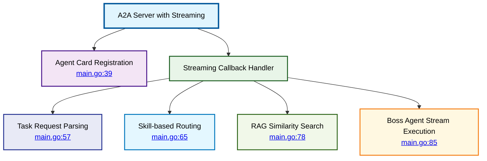
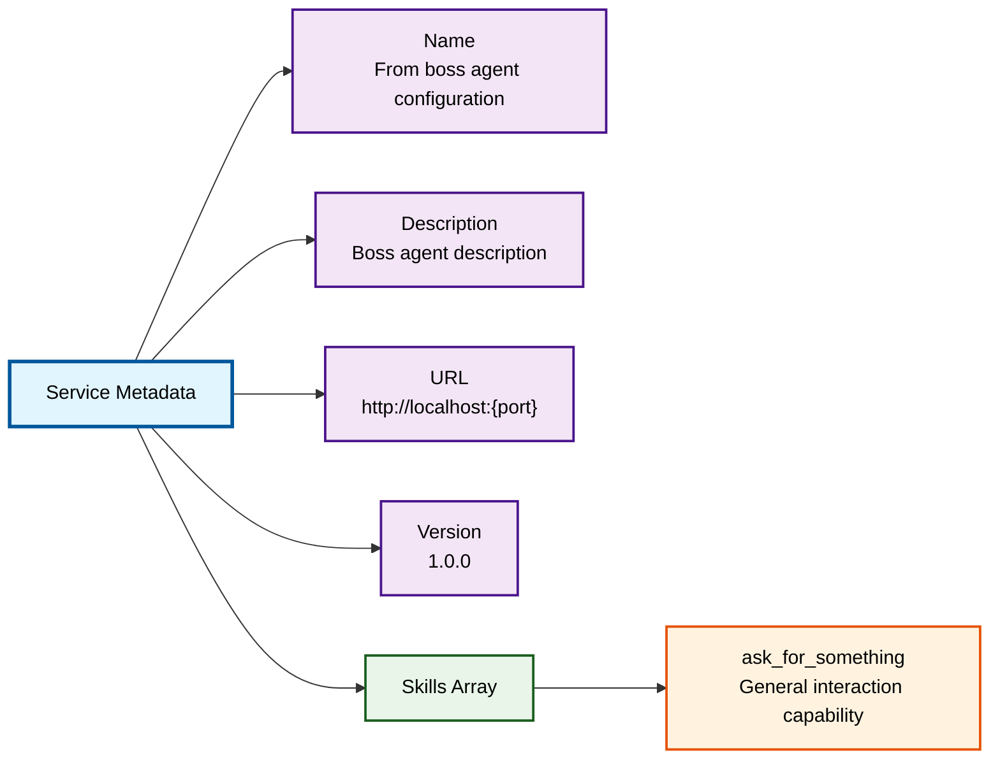
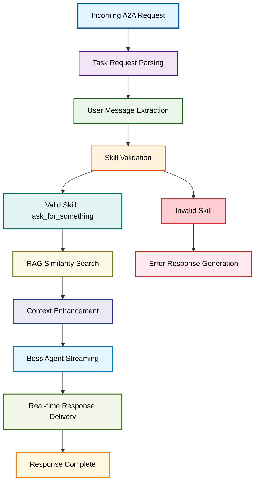
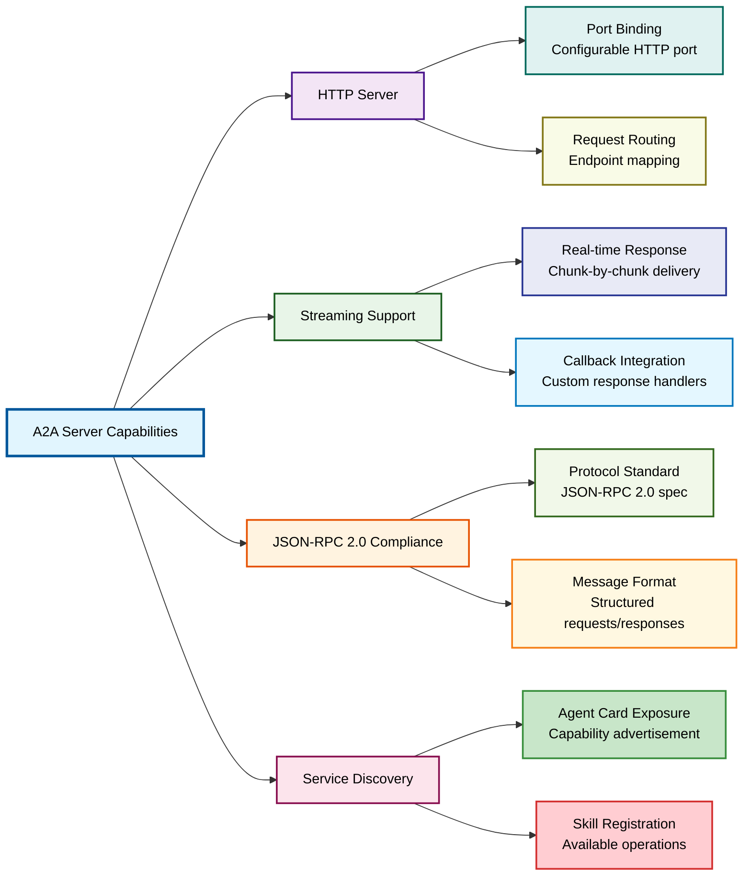

# Boss A2A Server Implementation

⬅️ **Back to:** [Boss Agent Schema](100-boss-agent-schema.md)

## A2A Server Overview

The A2A (Agent-to-Agent) server implementation enables the End-of-Level Boss service to communicate with other game services through a standardized HTTP protocol with streaming capabilities.



## Agent Card Configuration

The Agent Card serves as the service's public interface definition, advertising capabilities to other services.

### Card Structure
```go
agentCard := a2a.AgentCard{
    Name:        bossAgent.GetName(),
    Description: bossAgent.GetDescription(),
    URL:         "http://localhost:" + httpPort,
    Version:     "1.0.0",
    Skills: []map[string]any{
        {
            "id":          "ask_for_something",
            "name":        "Ask for something",
            "description": bossAgent.GetName() + " is using a small language model to answer questions",
        },
    },
}
```

### Service Metadata


**Metadata Properties**:
- **Dynamic Name**: Uses boss agent's configured name
- **Dynamic Description**: Reflects agent's character description
- **Service URL**: Constructed from configured HTTP port
- **Version**: Static version for API compatibility
- **Skills**: Array of available capabilities

## Streaming Callback Implementation

The streaming callback function handles incoming requests and orchestrates the response generation process.

### Request Processing Pipeline



### 1. Task Request Parsing
```go
fmt.Printf("🟢 Processing streaming task request: %s\n", taskRequest.ID)
userMessage := taskRequest.Params.Message.Parts[0].Text
fmt.Printf("🔵 UserMessage: %s\n", userMessage)
fmt.Printf("🟡 TaskRequest Metadata: %v\n", taskRequest.Params.MetaData)
```

**Parsing Process**:
- **Request ID**: Unique identifier for tracking
- **Message Extraction**: Retrieves user's text from message parts
- **Metadata Access**: Extracts routing and context information
- **Logging**: Comprehensive debug output for monitoring

### 2. Skill-based Routing
```go
var userPrompt string

switch taskRequest.Params.MetaData["skill"] {
case "ask_for_something":
    userPrompt = userMessage
default:
    userPrompt = "Be nice, and explain that " + fmt.Sprintf("%v", taskRequest.Params.MetaData["skill"]) + " is not a valid task ID."
}
```

**Routing Logic**:
- **Valid Skill**: `ask_for_something` processes user message directly
- **Invalid Skill**: Generates helpful error message
- **Extensible**: Easy to add new skills by extending the switch statement
- **User-Friendly**: Polite error handling for invalid requests

### 3. RAG Integration
```go
bossAgentMessages, err := GeneratePromptMessagesWithSimilarities(ctx, &client, bossAgent.GetName(), userPrompt, similaritySearchLimit, similaritySearchMaxResults)

if err != nil {
    ui.Println(ui.Red, "Error:", err)
}
```

**RAG Enhancement**:
- **Context Search**: Finds relevant background information
- **Similarity Threshold**: Configurable relevance filtering
- **Result Limiting**: Controls context volume
- **Error Resilience**: Continues without RAG if search fails

### 4. Boss Agent Streaming Execution
```go
_, err = bossAgent.RunStream(
    bossAgentMessages,
    func(content string) error {
        if content != "" {
            fmt.Print(content)         // Print to console for debugging
            return streamFunc(content) // Stream to client
        }
        return nil // Continue streaming
    })
```

**Streaming Execution**:
- **Real-time Processing**: Content delivered as it's generated
- **Dual Output**: Console logging and client streaming
- **Error Handling**: Stream errors propagated to client
- **Content Filtering**: Empty content ignored

## Server Initialization

### A2A Server Creation
```go
a2aServer := a2a.NewA2AServerWithStreaming(helpers.StringToInt(httpPort), agentCard, agentStreamCallback)
fmt.Println("🚀 Starting A2A server with streaming support on port:", httpPort)
if err := a2aServer.Start(); err != nil {
    fmt.Printf("❌ Failed to start A2A server: %v\n", err)
}
```

**Initialization Parameters**:
- **Port Configuration**: HTTP port from environment variable
- **Agent Card**: Service metadata and capabilities
- **Streaming Callback**: Request handling function
- **Error Handling**: Startup failure reporting

### Server Capabilities



## Communication Protocol

### JSON-RPC 2.0 Message Format
The server expects requests in JSON-RPC 2.0 format:

```json
{
  "id": "task-1699123456",
  "jsonrpc": "2.0",
  "method": "message/send",
  "params": {
    "message": {
      "role": "user",
      "parts": [
        {
          "text": "Hello, boss! What challenges await?",
          "type": "text"
        }
      ]
    },
    "metadata": {
      "skill": "ask_for_something"
    }
  }
}
```

### Streaming Response Protocol
Responses are delivered in real-time chunks:

```json
{
  "id": "task-1699123456",
  "result": {
    "status": {
      "state": "completed"
    },
    "history": [
      {
        "role": "assistant",
        "parts": [
          {
            "text": "Greetings, adventurer! I am the guardian of this realm...",
            "type": "text"
          }
        ]
      }
    ]
  }
}
```

## Debug Mode Integration

### Debug Command Handling
```go
if strings.HasPrefix(userPrompt, "/debug") {
    msg.DisplayHistory(bossAgent)
}
```

**Debug Features**:
- **Trigger**: Commands starting with `/debug`
- **History Display**: Shows conversation history
- **Development Aid**: Helps troubleshoot agent behavior
- **Non-intrusive**: Doesn't affect normal operation

## Integration Benefits

### Service Architecture
- **Microservice Design**: Independent boss service
- **Standard Protocol**: A2A compatibility with other services
- **Configurable Deployment**: Environment-based configuration
- **Monitoring Support**: Comprehensive logging and debug output

### Extensibility
- **Skill Addition**: Easy to add new capabilities
- **Custom Handlers**: Flexible callback system
- **Protocol Compliance**: Standard JSON-RPC 2.0 interface
- **Client Agnostic**: Works with any A2A-compatible client

---

⬅️ **Back to:** [Boss Agent Schema](100-boss-agent-schema.md)