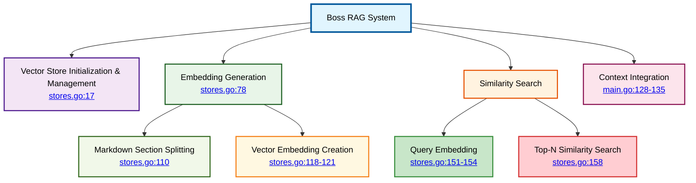
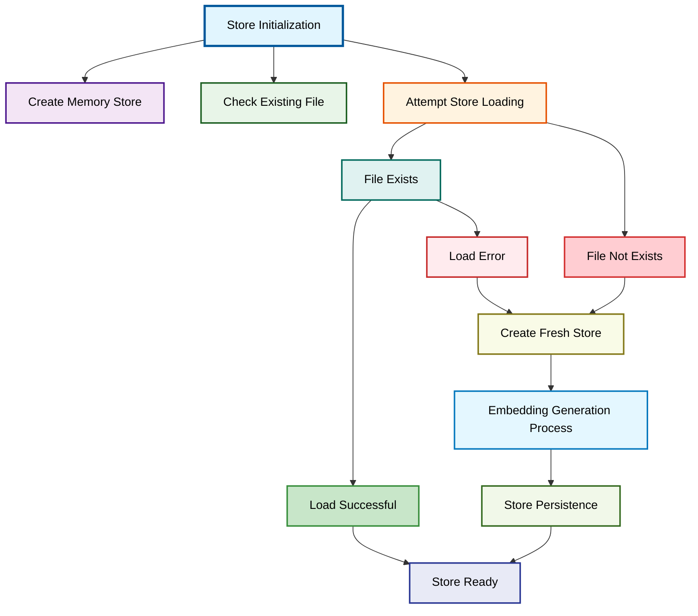
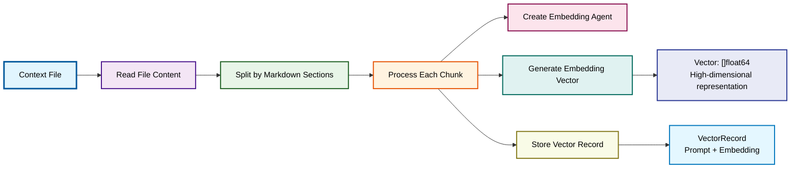
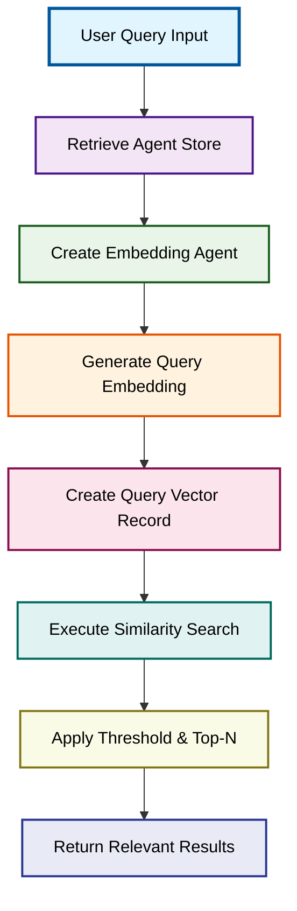
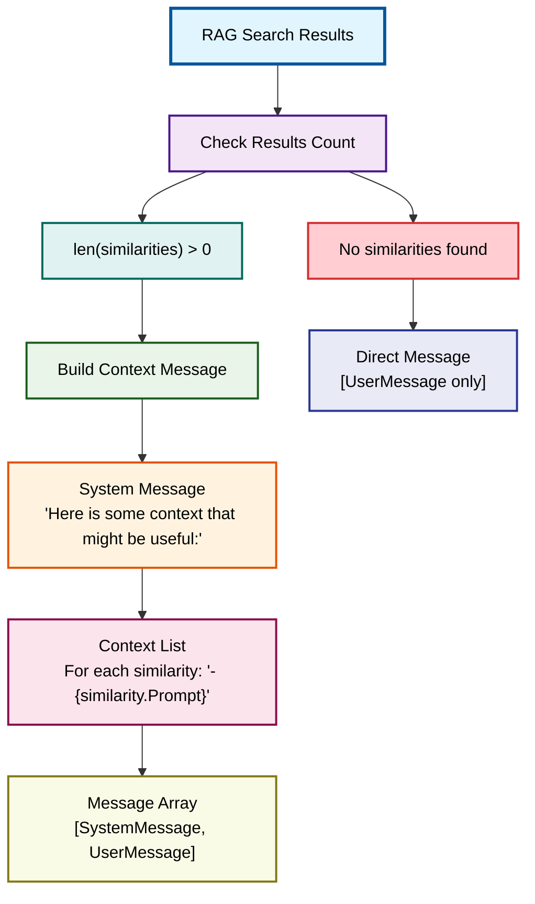

# Boss RAG System Implementation

⬅️ **Back to:** [Boss Agent Schema](100-boss-agent-schema.md)

## RAG System Overview

The RAG (Retrieval-Augmented Generation) system enhances the End-of-Level Boss with contextual knowledge through vector embeddings and similarity search. This system enables the boss to provide responses that are informed by relevant background information and game lore.



## Vector Store Architecture

### Global Store Management
```go
var AgentsStores = make(map[string]rag.MemoryVectorStore)
```

**Store Organization**:
- **Agent-Specific**: Each agent maintains its own vector store
- **Memory-Based**: In-memory storage for fast access
- **Map Structure**: Agent name as key, vector store as value
- **Persistent**: Stores can be saved/loaded from files

### Store Initialization Process



### Store Loading Logic
```go
AgentsStores[name] = rag.MemoryVectorStore{
    Records: make(map[string]rag.VectorRecord),
}
store := AgentsStores[name]

jsonStoreFilePath := helpers.GetEnvOrDefault("VECTOR_STORES_PATH", "./data") + "/" + strings.ToLower(name) + "_vector_store.json"
fmt.Println("🔶 Loading vector store from:", jsonStoreFilePath)

err := store.Load(jsonStoreFilePath)
```

**Loading Process**:
- **Store Creation**: Initialize empty memory store
- **File Path**: Constructed from agent name and base path
- **Automatic Recovery**: Loads existing embeddings if available
- **Graceful Fallback**: Creates new store if file doesn't exist

## Embedding Generation Process

### Context File Processing
```go
if contextInstructionsContentPath == "" {
    fmt.Println("🔶 No context path provided, using default instructions.")
    return fmt.Errorf("no context path provided")
}

contextInstructionsContent, err := helpers.ReadTextFile(contextInstructionsContentPath)
if err != nil {
    fmt.Println("🔶 Error reading the file, using default instructions:", err)
    return err
}
```

**File Handling**:
- **Path Validation**: Checks for context file path
- **Content Reading**: Loads markdown content for processing
- **Error Handling**: Returns errors for missing or unreadable files
- **Source Control**: External files allow easy content updates

### Chunk Creation and Embedding



### Embedding Agent Creation
```go
embeddingAgent, err := mu.NewAgent(ctx, "vector-agent",
    mu.WithClient(*client),
    mu.WithEmbeddingParams(
        openai.EmbeddingNewParams{
            Model: helpers.GetEnvOrDefault("EMBEDDING_MODEL", "ai/mxbai-embed-large:latest"),
        },
    ),
)
```

**Agent Configuration**:
- **Dedicated Agent**: Separate agent for embedding generation
- **Model Selection**: Configurable embedding model
- **Client Injection**: Uses same OpenAI client as boss agent
- **Default Model**: `mxbai-embed-large` for high-quality embeddings

### Chunk Processing Loop
```go
chunks := rag.SplitMarkdownBySections(contextInstructionsContent)

for idx, chunk := range chunks {
    fmt.Println("🔶 Chunk", idx, ":", chunk)
    embeddingVector, err := embeddingAgent.GenerateEmbeddingVector(chunk)
    if err != nil {
        return err
    }
    _, errSave := store.Save(rag.VectorRecord{
        Prompt:    chunk,
        Embedding: embeddingVector,
    })

    if errSave != nil {
        fmt.Println("🔴 When saving the vector", errSave)
        return errSave
    }
    fmt.Println("✅ Chunk", idx, "saved with embedding:", len(embeddingVector))
}
```

**Processing Features**:
- **Markdown Splitting**: Intelligent section-based chunking
- **Progress Tracking**: Logs each chunk processing
- **Error Propagation**: Stops on embedding or save errors
- **Vector Validation**: Logs embedding vector dimensions

## Similarity Search Implementation

### Search Function Interface
```go
func SearchSimilarities(ctx context.Context, client *openai.Client, agentName string, input string, threshold float64, topN int) ([]rag.VectorRecord, error)
```

**Parameters**:
- **Agent Name**: Identifies which vector store to search
- **Input**: User query for similarity comparison
- **Threshold**: Minimum similarity score (0.0-1.0)
- **Top N**: Maximum number of results to return

### Query Processing Pipeline



### Similarity Search Execution
```go
store := AgentsStores[agentName]

embeddingAgent, err := mu.NewAgent(ctx, "vector-agent",
    mu.WithClient(*client),
    mu.WithEmbeddingParams(
        openai.EmbeddingNewParams{
            Model: helpers.GetEnvOrDefault("EMBEDDING_MODEL", "ai/mxbai-embed-large:latest"),
        },
    ),
)

questionEmbeddingVector, err := embeddingAgent.GenerateEmbeddingVector(input)
questionRecord := rag.VectorRecord{Embedding: questionEmbeddingVector}

similarities, err := store.SearchTopNSimilarities(questionRecord, threshold, topN)
```

**Search Process**:
- **Store Selection**: Retrieves agent-specific vector store
- **Embedding Generation**: Creates query vector using same model
- **Vector Comparison**: Computes cosine similarity with stored vectors
- **Result Ranking**: Orders by similarity score
- **Filtering**: Applies threshold and count limits

### Result Processing and Logging
```go
fmt.Println("📝 Similarities found:", len(similarities))

for _, similarity := range similarities {
    fmt.Println("✅ CosineSimilarity:", similarity.CosineSimilarity, "Chunk:", similarity.Prompt)
}
```

**Result Analysis**:
- **Count Reporting**: Shows how many relevant chunks found
- **Score Display**: Logs similarity scores for debugging
- **Content Preview**: Shows matched chunk content
- **Performance Monitoring**: Helps tune threshold and count parameters

## Context Integration

### Message Enhancement Function
The `GeneratePromptMessagesWithSimilarities` function in `main.go` integrates RAG results into the conversation:

```go
func GeneratePromptMessagesWithSimilarities(ctx context.Context, client *openai.Client, agentName, input string, similarityLimit float64, maxResults int) ([]openai.ChatCompletionMessageParamUnion, error)
```

### Context Message Generation



### Context Message Construction
```go
if len(similarities) > 0 {
    similaritiesMessage := "Here is some context that might be useful:\n"
    for _, similarity := range similarities {
        similaritiesMessage += fmt.Sprintf("- %s\n", similarity.Prompt)
    }
    return []openai.ChatCompletionMessageParamUnion{
        openai.SystemMessage(similaritiesMessage),
        openai.UserMessage(input),
    }, nil
} else {
    fmt.Println("📝 No similarities found.")
    return []openai.ChatCompletionMessageParamUnion{
        openai.UserMessage(input),
    }, nil
}
```

**Message Structure**:
- **System Context**: Provides relevant background information
- **User Message**: Original user query
- **Conditional**: Only includes context if relevant similarities found
- **Formatted**: Context presented as bulleted list

## Configuration and Tuning

### Environment Variables
- **`VECTOR_STORES_PATH`**: Directory for storing vector databases (default: `./data`)
- **`EMBEDDING_MODEL`**: Model for generating embeddings (default: `ai/mxbai-embed-large:latest`)
- **`BOSS_CONTEXT_PATH`**: Path to boss context file
- **`SIMILARITY_LIMIT`**: Minimum similarity threshold (default: `0.5`)
- **`SIMILARITY_MAX_RESULTS`**: Maximum context chunks (default: `2`)

### Performance Tuning
- **Similarity Threshold**: Higher values (0.7-0.9) for more relevant context
- **Max Results**: Balance between context richness and prompt length
- **Embedding Model**: Trade-off between quality and speed
- **Chunk Size**: Affects granularity of context retrieval

## System Benefits

### Enhanced Responses
- **Contextual Awareness**: Boss responses informed by game lore
- **Consistency**: Maintains character knowledge across interactions
- **Relevance**: Only includes pertinent background information
- **Adaptability**: Easy to update context without code changes

### Performance Characteristics
- **Fast Retrieval**: In-memory vector search
- **Efficient Storage**: Persistent JSON-based vector stores
- **Scalable**: Agent-specific stores prevent cross-contamination
- **Cache-Friendly**: Pre-computed embeddings eliminate runtime processing

### Maintenance Advantages
- **External Content**: Context files separate from code
- **Debug Visibility**: Comprehensive logging for troubleshooting
- **Configurable Parameters**: Environment-based tuning
- **Error Resilience**: Graceful degradation when RAG fails

---

⬅️ **Back to:** [Boss Agent Schema](100-boss-agent-schema.md)