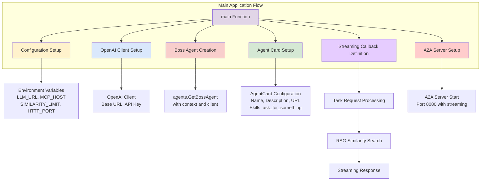
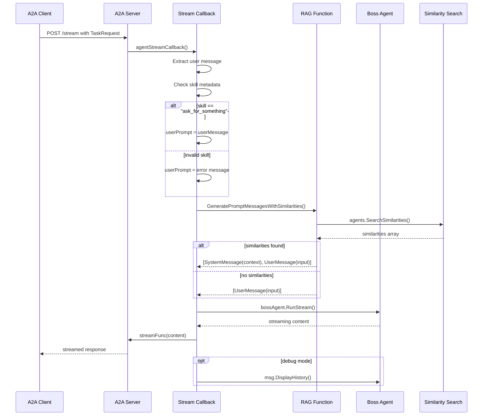
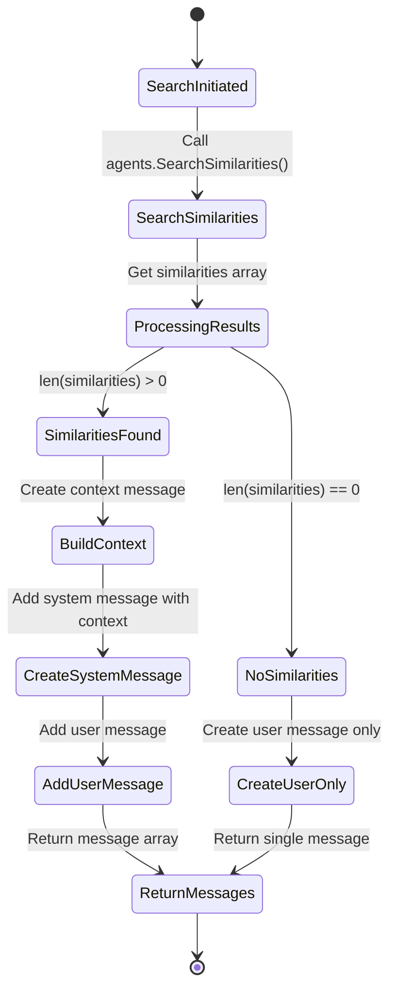
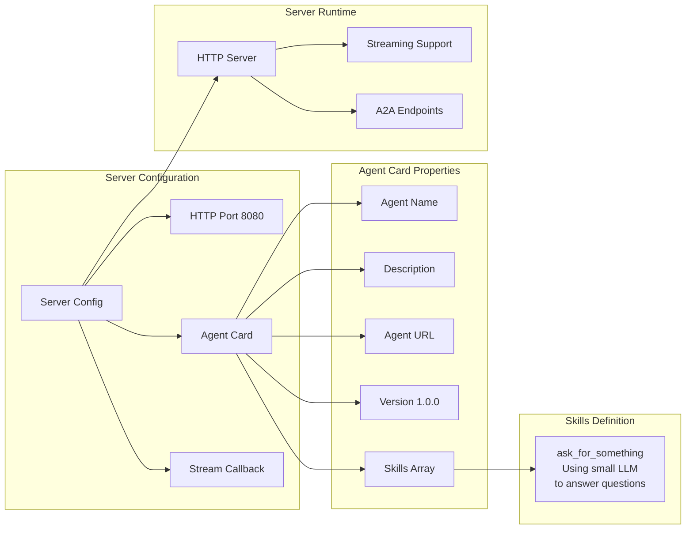
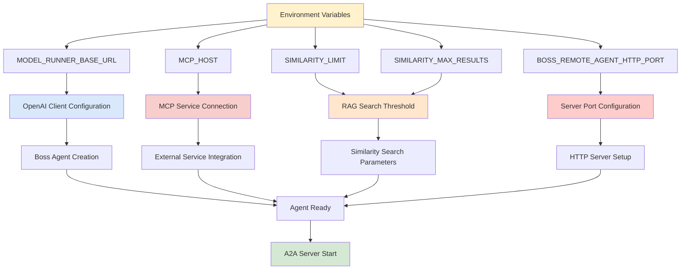
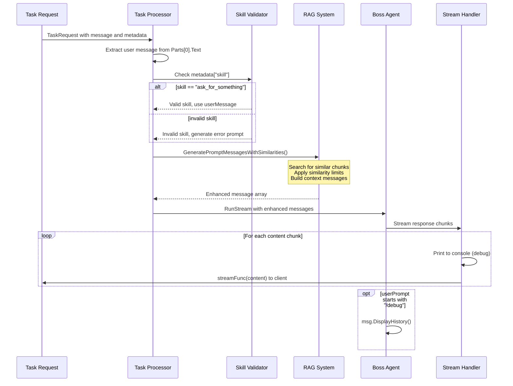

# End-of-Level Boss Agent Architecture

This document explains the architecture and flow of the End-of-Level Boss Agent application using various diagrams and explanations.

## System Architecture Overview

### System Architecture Explanation

This diagram shows the initialization flow of the End-of-Level Boss Agent system. The main function orchestrates seven primary components: Configuration loading from environment variables, OpenAI client setup for LLM communication, Boss agent creation using the agents package, Agent card configuration for A2A protocol, Streaming callback definition for handling requests, and A2A server setup for HTTP communication. This creates a complete Agent-to-Agent (A2A) server that can handle streaming conversations with RAG (Retrieval-Augmented Generation) capabilities.

## Agent Streaming Callback Flow

### Agent Streaming Callback Explanation

This sequence diagram illustrates the complete flow when a client makes a streaming request to the A2A server. The process begins with task request processing, validates the skill type, performs RAG similarity search to gather relevant context, and then streams the boss agent's response back to the client. The RAG system enhances responses by finding similar historical interactions, while the streaming mechanism provides real-time response delivery. Debug functionality allows inspection of the conversation history when requested.

## RAG Similarity Search Process

### RAG Similarity Search Explanation

This state diagram shows how the RAG (Retrieval-Augmented Generation) system processes user input to find relevant contextual information. The system searches for similar chunks of text based on the input, applying similarity limits and maximum result constraints. When similarities are found, they are formatted into a context message that becomes part of the system prompt, enhancing the agent's response with relevant background information. This approach allows the boss agent to provide more informed and contextually appropriate responses based on previous interactions or knowledge.

## A2A Server Configuration and Startup

### A2A Server Configuration Explanation

This diagram illustrates the configuration and structure of the A2A (Agent-to-Agent) server. The server is configured with specific properties including the HTTP port, agent card metadata, and streaming callback function. The agent card defines the boss agent's capabilities and available skills, currently supporting the "ask_for_something" skill for general question answering. The server provides streaming support for real-time response delivery and implements the A2A protocol endpoints for agent communication.

## Environment Configuration and Dependencies

### Environment Configuration Explanation

This flowchart demonstrates how environment variables configure the various components of the boss agent system. The configuration process reads multiple environment variables to set up the LLM connection, MCP service integration, RAG search parameters, and server settings. Each configuration aspect feeds into specific system components: the OpenAI client for LLM communication, MCP host for external service integration, similarity search parameters for RAG functionality, and HTTP port for the A2A server. This flexible configuration approach allows the system to adapt to different deployment environments and requirements.

## Task Processing and Response Generation

### Task Processing and Response Generation Explanation

This sequence diagram shows the detailed process of handling incoming task requests and generating streaming responses. The system extracts and validates the user message, checks skill metadata to ensure the request is valid, enhances the prompt using RAG similarity search, and then generates a streaming response through the boss agent. The streaming mechanism allows real-time response delivery while maintaining debug capabilities for development and troubleshooting. Error handling ensures that invalid skills receive appropriate error messages rather than causing system failures.