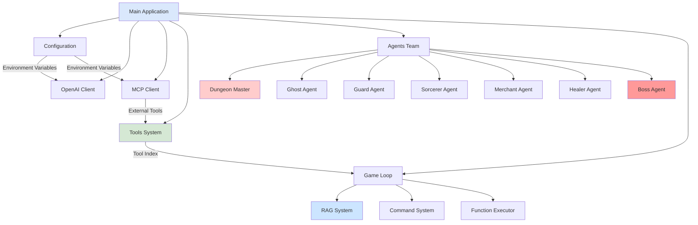
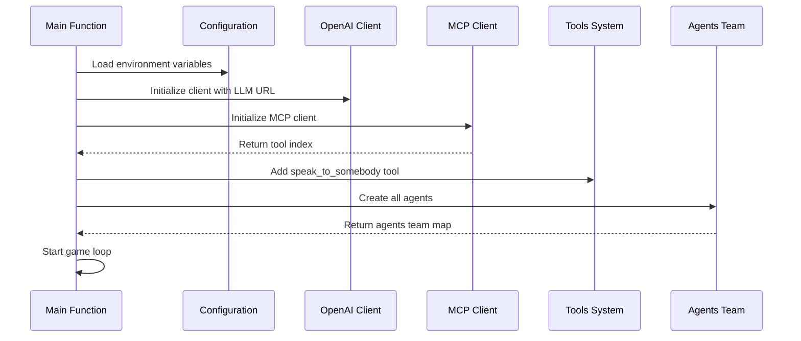
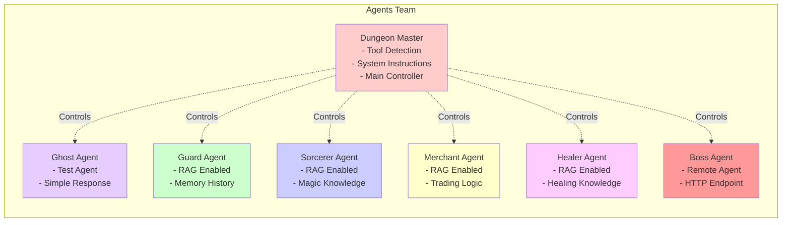
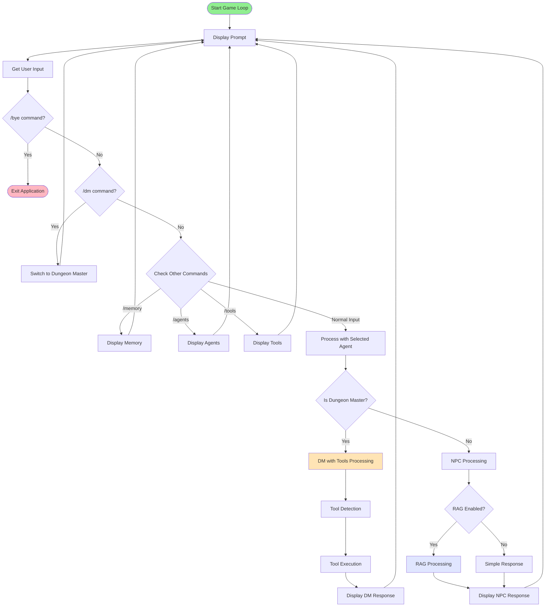
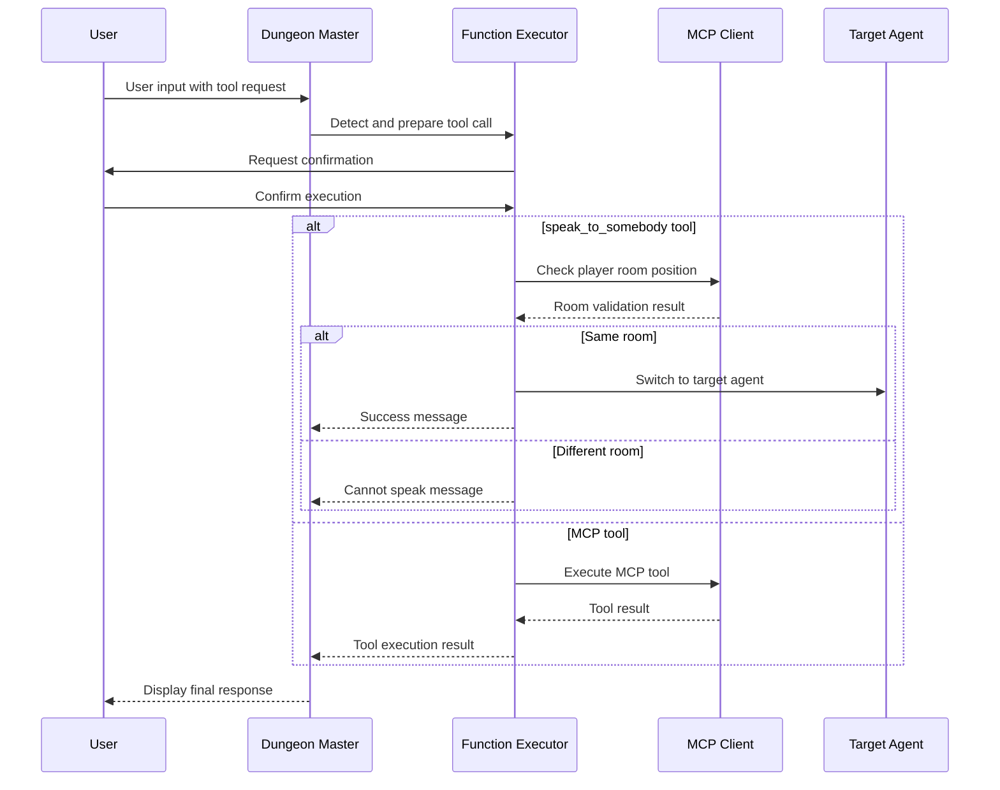
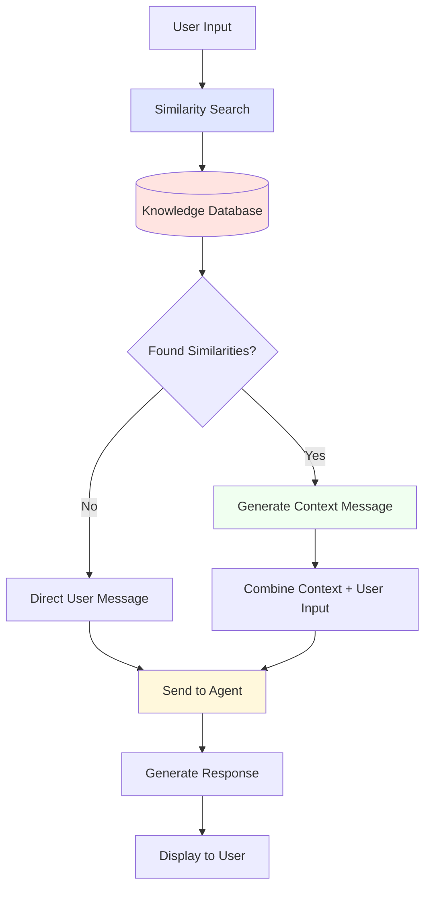
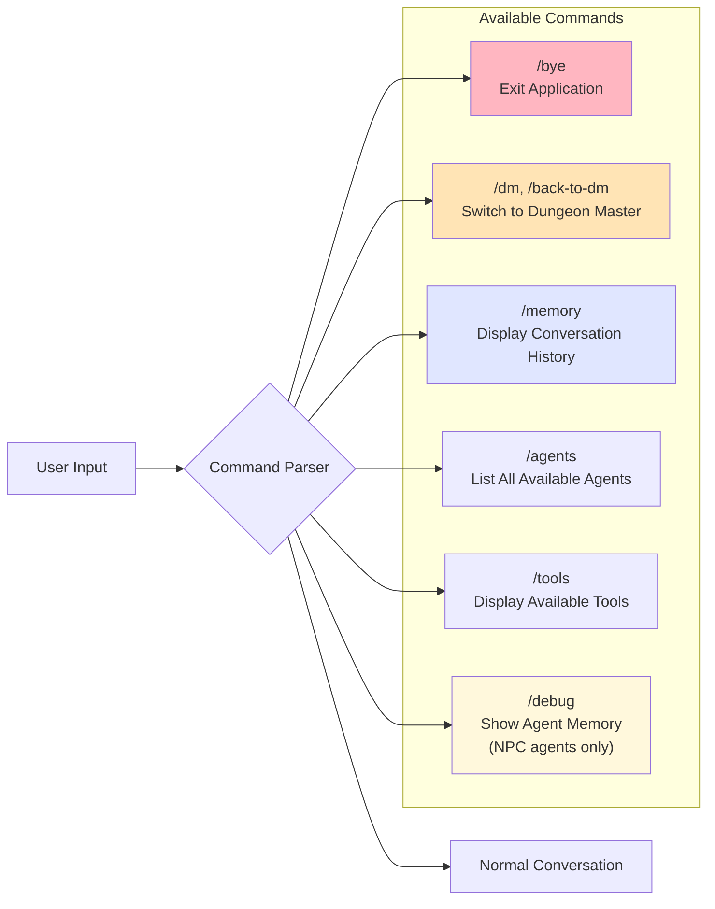

# Dungeon Master Application Architecture

This document explains the architecture and flow of the Dungeon Master application (`main.go`) using various diagrams and explanations.

## System Architecture Overview

### Architecture Explanation

The Dungeon Master application is built around a multi-agent system that provides an interactive text-based gaming experience. The main application initializes various components including OpenAI clients for LLM communication, MCP (Model Context Protocol) clients for external tool integration, and a team of specialized agents representing different characters in the dungeon.

## Application Initialization Flow

### Initialization Explanation

The application starts by loading configuration from environment variables, then initializes the OpenAI client for LLM communication and the MCP client for external tool integration. It creates a comprehensive tools system and assembles a team of agents, each with specific roles and capabilities. Finally, it enters the main game loop to handle user interactions.

## Agents Team Structure

### Agents Team Explanation

The agents team consists of seven distinct characters, each with unique capabilities. The Dungeon Master serves as the primary controller with tool detection capabilities. Most agents (Guard, Sorcerer, Merchant, Healer) are enhanced with RAG (Retrieval-Augmented Generation) for contextual responses. The Ghost agent is used for testing, while the Boss agent operates as a remote service via HTTP endpoints.

## Main Game Loop Flow

### Game Loop Explanation

The main game loop continuously processes user input and routes it to appropriate handlers. It supports various commands for navigation and debugging, and handles different agent types differently. The Dungeon Master agent uses tool detection and execution, while NPC agents may use RAG for enhanced contextual responses.

## Tool Execution System

### Tool Execution Explanation

The tool execution system provides a secure way to execute both custom tools (like `speak_to_somebody`) and MCP tools. It includes user confirmation for security, room validation for agent interaction, and proper error handling. The system ensures players can only interact with NPCs in the same room and provides appropriate feedback for all scenarios.

## RAG (Retrieval-Augmented Generation) System

### RAG System Explanation

The RAG system enhances agent responses by searching for relevant context from a knowledge database. When a user interacts with RAG-enabled agents (Guard, Sorcerer, Merchant, Healer), the system performs similarity searches to find relevant information, then combines this context with the user's input to generate more informed and contextual responses.

## Command System

### Command System Explanation

The application provides a comprehensive command system for navigation and debugging. Users can exit the game, switch between agents, view conversation history, list available agents and tools, and access debug information. This system ensures smooth navigation and provides transparency about the application's capabilities and state.